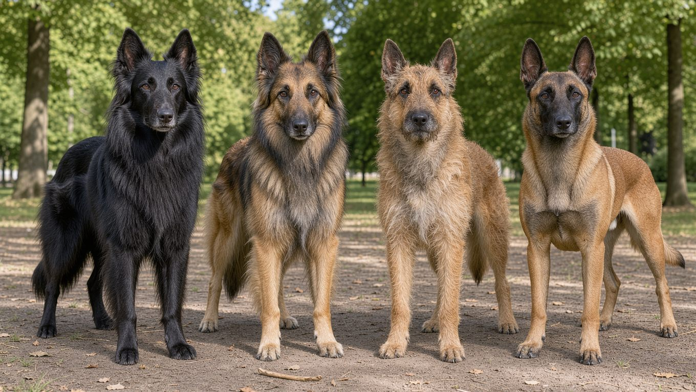

**2026년 10월 6일 기준**

## 빠른 답

- **성격 한 줄**: 한 사람에게 깊게 붙는 작업견이다. 활동성이 견종 최상위권이라 몸과 머리를 함께 써 줄 보호자가 필요하다.
- **아파트에서 키울 수 있나?**: 운동량이 전부다. PetMD는 '보호자와 함께하는 하루 40분 이상'을 최소선으로 제시하고 아침 8km 달리기를 예로 든다. 이 루틴을 매일 지킬 수 있다면 가능하다.
- **처음 키우는 사람에게 맞나?**: 아니다. 훈련과 사회화를 책임지고 매일 운동을 소화해 줄 경험이 있어야 한다.

## 품종 개요

벨지안 말리노이즈는 벨기에 원산의 목양견이다. 벨지안 시프도그(Belgian Shepherd)는 벨기에 목양견을 한 품종으로 묶은 이름으로, 모질과 모색에 따라 그루넨달·테뷰런·라케노이즈·말리노이즈 네 계열로 나뉜다. 네 계열 전체의 털과 색은 아래 색상 섹션에서 비교해 뒀다. 이 가운데 단모에 황갈색 몸통을 가진 갈래가 말리노이즈다. 이름은 벨기에 도시 말린(Malines, 메헬렌)에서 왔다. 국내 표기는 '벨지안 말리노이즈'가 일반적이고, '벨기에 말리노이즈'로 쓰는 곳도 있다.

이 견종을 대중적으로 알린 것은 군견 이력이다. 2011년 빈 라덴 작전에 투입된 군견 카이로, 2019년 IS 수괴 알바그다디 제거 작전에 참여한 군견(일부 언론은 '코넌'으로 보도했다)이 모두 말리노이즈였다. 미군 군견 가운데 저먼 셰퍼드와 함께 가장 흔한 품종으로 꼽힌다. 생김새가 닮아 자주 비교되는 견종이 [저먼 셰퍼드](/breeds/german-shepherd/)다.

국내에서도 군·경 활약상이 있다. 경찰 체취증거견·수색견으로 뛰었고, 119구조본부 인명구조견 가운데도 이 견종이 있다(연합뉴스·소방청). 다만 이 이력은 훈련이 받쳐 준 작업견의 결과라는 점이 중요하다. 같은 혈통이라도 반려가정에서 운동 없이 자라면 문제 행동으로 이어진다.

<dl>
<dt>크기</dt>
<dd>체고 수컷 61~66cm · 암컷 56~61cm (PetMD)</dd>
<dt>체중</dt>
<dd>수컷 27~36kg · 암컷 18~27kg (PetMD)</dd>
<dt>수명</dt>
<dd>10~14년 (PetMD)</dd>
<dt>운동량</dt>
<dd>하루 40분 이상이 최소 — 산책만으로는 부족</dd>
<dt>털 관리 난이도</dt>
<dd>낮음 — 단, 봄·가을 속털 털갈이가 몰린다</dd>
<dt>초보 적합도</dt>
<dd>낮음</dd>
</dl>

출처에 따라 체중·수명 폭이 갈린다. 국내 보도(연합뉴스)는 다 자란 수컷 25~30kg, 수명 14~16년으로 소개했다.

## 성격과 기질

말리노이즈는 자신감이 있고 지능이 높으며, 사람에게 깊게 붙어 일하기를 좋아하는 견종이다(PetMD). 가만히 두고 예뻐해 주는 것으로는 만족하지 못하고, 맡을 일이 있어야 안정을 찾는다.

혼자 두면 문제가 드러난다. PetMD는 이 견종을 "마당에 풀어 두면 알아서 놀 견종이 아니다"라고 표현한다. 운동과 자극이 모자라면 가구·신발·문을 물어뜯고 땅을 파는 행동이 나온다. 사냥 본능도 강해서 차나 다른 동물, 뛰는 아이를 뒤쫓을 수 있다. 목줄 관리가 기본이다.

## 털무늬·색상 변형

말리노이즈의 모색은 황갈색 한 계열이다. 풀(fawn)에서 붉은 기가 도는 마호가니까지 폭이 있고, 얼굴과 귀에 검은 마스크가 얹힌다. 짧고 방수성을 갖춘 단모가 몸을 덮는다(PetMD).

시프도그 네 계열은 모질과 모색으로 구분한다.

- **그루넨달** — 장모 · 흑색 단색
- **테뷰런** — 장모 · 황갈색~마호가니, 검은 마스크
- **라케노이즈** — 강모 · 황갈색 계열
- **말리노이즈** — 단모 · 풀~마호가니, 검은 마스크·귀

유럽 FCI는 이 넷을 벨지안 시프도그 한 품종의 변종으로 보고, 미국 AKC는 각각을 별도 품종으로 등록한다. 등록 체계가 나뉘어 있어 해외 자료에서는 이름이 섞여 쓰인다.

## 한국에서 키울 때

### 분양 시세

국내 분양 시세를 정리한 공개 자료를 찾기 어려웠다. 군·경·탐지 도입이 본류인 견종이라 반려 목적 분양 물량 자체가 적고, 시장이 훈련소와 수입 브리더를 중심으로 돌아간다. 가격은 부모견 건강검사와 훈련 이력에 따라 갈리므로, 분양을 생각한다면 브리더에게 직접 조건을 확인하는 편이 안전하다.

### 아파트

법적으로는 제한이 없다. 법정 맹견 5종(도사견·핏불테리어·아메리칸 스태퍼드셔 테리어·스태퍼드셔 불테리어·로트와일러)에 들지 않아 입마개 의무도 해당하지 않는다([입마개 가이드](/guides/dog-muzzle/)). 문제는 운동량이다. 하루 40분 이상을 최소로 잡고 아침 8km 달리기를 예로 드는 견종이라(PetMD), 새벽·야간 운동 시간을 확보할 수 있는지가 아파트 사육의 실제 관문이다.

### 여름

관리 포인트는 털보다 시간대다. 한낮 아스팔트를 피해 새벽·밤으로 산책을 옮기고 그늘 휴식을 챙긴다([산책 가이드](/guides/dog-walking/)). 봄·가을 털갈이 때 속털을 빗으로 정리해 두면 한여름이 한결 수월하다.

### 흔한 유전병

- **고관절·팔꿈치 이형성증** — 가장 자주 언급되는 골격 질환으로, 절뚝거림·토끼뜀·계단 오르기 회피가 신호다(PetMD·Adoptapet). 부모견 검사가 예방의 출발점이다
- **진행성 망막 위축(PRA)** — 망막이 서서히 퇴화해 실명에 이르는 유전 질환. 야간 시력부터 떨어지고 치료법이 없다(PetMD)
- **백내장** — 수정체가 흐려지는 질환. 수술로 렌즈를 교체할 수 있다(PetMD)
- **간질** — 발작 질환으로, 혈통 이력을 확인하라는 권고가 따른다(Adoptapet)
- **마취 감수성** — 이 견종에서 흔히 보고되는 특성이라 수술 전 수의사에게 알려야 한다(Adoptapet)

책임 있는 브리더의 개체는 건강한 편이라는 평가가 많다(PetMD). 부모견의 고관절·눈 검사 이력을 확인하고 데려오는 것이 기본이다.

## 관리법

### 털

단모라 관리 난이도는 낮다. 다만 속털이 있어 봄·가을에 걸쳐 2~3주간 털갈이가 몰려온다(PetMD). 이 시기에는 빗질 횟수를 늘리는 것으로 대응한다. 도구는 [빗 비교 가이드](/guides/dog-brush-comparison/)에서 털 유형별로 정리했다.

### 운동

PetMD는 하루 40분 이상의 운동을 최소선으로 제시하며, 아침 5마일(약 8km) 달리기를 예로 든다. 걷기만으로는 부족하고 어질리티·추적 같은 '일'이나 노즈워크 같은 두뇌 작업을 얹어야 한다. 비 오는 날의 대체 운동은 [노즈워크 가이드](/guides/home-nosework/)를 참고한다.

### 훈련

훈련과 사회화는 어릴 때 시작해 평생 이어간다(PetMD). 견종을 아는 전문가의 도움을 권한다. 지능이 높아 배우는 속도는 빠르지만, 못 채워 준 몫은 파괴 행동으로 돌아온다. 기초 명령은 [기본 훈련 가이드](/guides/dog-basic-training/)의 순서를 따른다.

## 자주 묻는 질문

### 벨지안 셰퍼드와 말리노이즈는 같은 견종인가요?

등록 체계에 따라 다릅니다. 유럽 FCI는 시프도그 한 품종 아래 그루넨달·테뷰런·라케노이즈·말리노이즈 네 변종을 두고, 미국 AKC는 넷을 각각 별도 품종으로 등록합니다. 국내에서는 '벨지안 말리노이즈'가 통용 표기입니다.

### 저먼 셰퍼드와 무엇이 다른가요?

둘 다 경찰·군견으로 쓰이는 목양견입니다. 말리노이즈가 체구가 조금 작고 날렵하며, 단모에 황갈색 몸통·검은 마스크가 특징입니다. 국내 보도에서는 다 자란 수컷이 25~30kg 정도로 소개되기도 합니다(연합뉴스). 저먼 셰퍼드 자체는 [저먼 셰퍼드 허브](/breeds/german-shepherd/)에서 다뤘습니다.

### 초보 견주가 키울 수 있나요?

가능은 하지만 권하지 않습니다. 운동량과 사냥 본능, 힘이 모두 상위권이라 훈련 경험이 없으면 일상이 견종에 끌려다니게 됩니다. 처음부터 전문가나 훈련소의 도움을 받는 조건이라면 이야기가 달라집니다.

### 하루에 얼마나 운동시켜야 하나요?

PetMD는 보호자와 함께하는 하루 40분 이상을 최소로 보고, 아침 8km 달리기를 예로 듭니다. 달리기나 어질리티 같은 고강도 운동에 노즈워크 같은 두뇌 작업을 더해야 합니다.

### 분양가는 얼마인가요?

국내 시세를 정리한 공개 자료를 찾기 어렵습니다. 반려 목적 분양 물량이 적고 수입 브리더·훈련소를 거치는 경우가 많아 가격 편차가 큽니다. 부모견 검사 여부와 훈련 이력까지 확인하고 브리더와 직접 상담하시길 권합니다.

## 출처

- [Belgian Malinois Dog Breed Health and Care — PetMD](https://www.petmd.com/dog/breeds/belgian-malinois) (크기·수명·운동 기준·털갈이·유전 질환)
- [Do Belgian Malinois have health problems? — Adopt a Pet](https://www.adoptapet.com/answers/do-belgian-malinois-have-health-problems) (고관절·팔꿈치 이형성증, 간질, 마취 감수성)
- [IS수괴 뒤쫓은 군견 '벨지안 말리노이즈' — 연합뉴스](https://www.yna.co.kr/view/AKR20191030026400071) (군견·경찰견 활용, 체중·수명 국내 보도)
- [119구조 은퇴견(우정) 프로필 — 소방청](https://rescue.go.kr/nanum/site/builder/dir/main/img/menu2480/file34.pdf) (인명구조견 사례)
- [벨지안 시프도그 — 위키백과](https://ko.wikipedia.org/wiki/벨지안_시프도그) (시프도그 네 계열 구분)
- 표지 이미지: AI 생성
