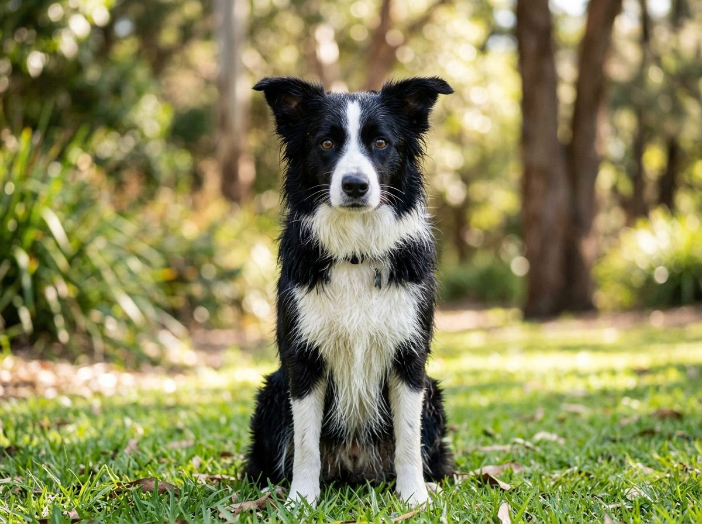
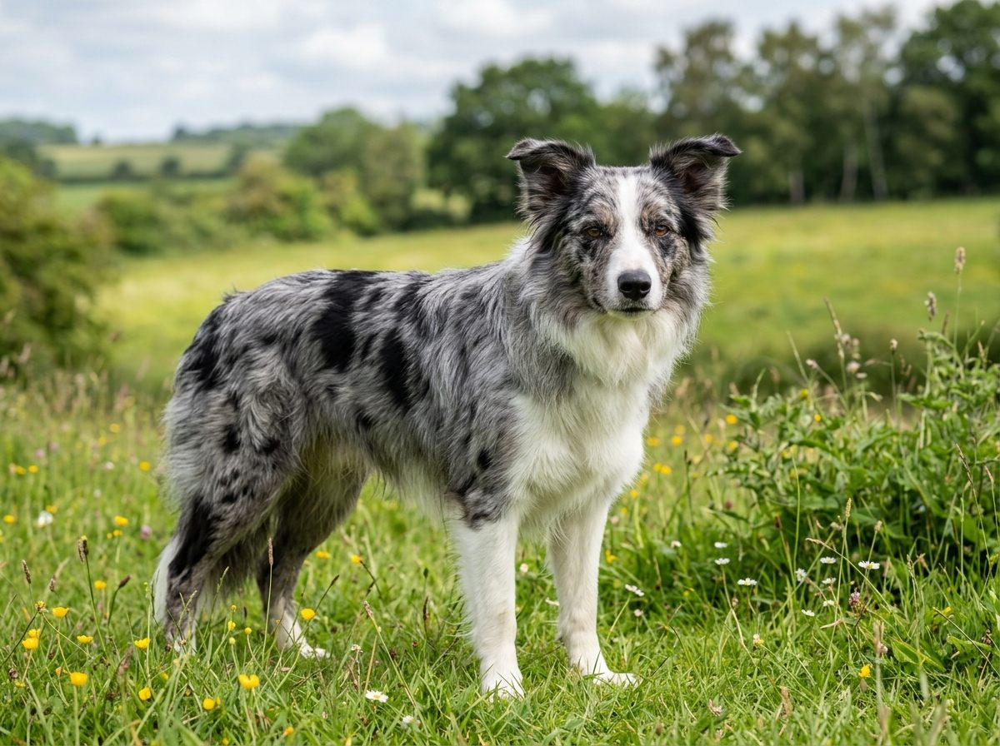
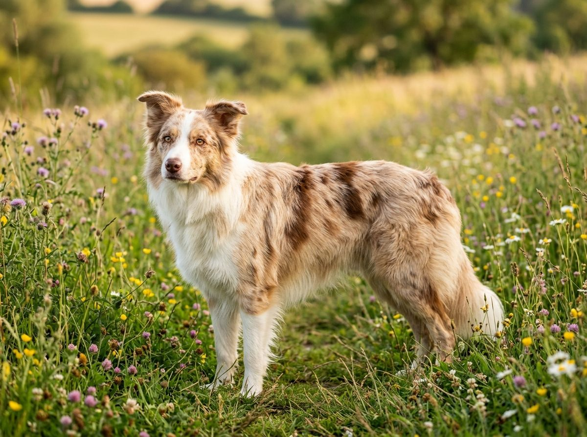
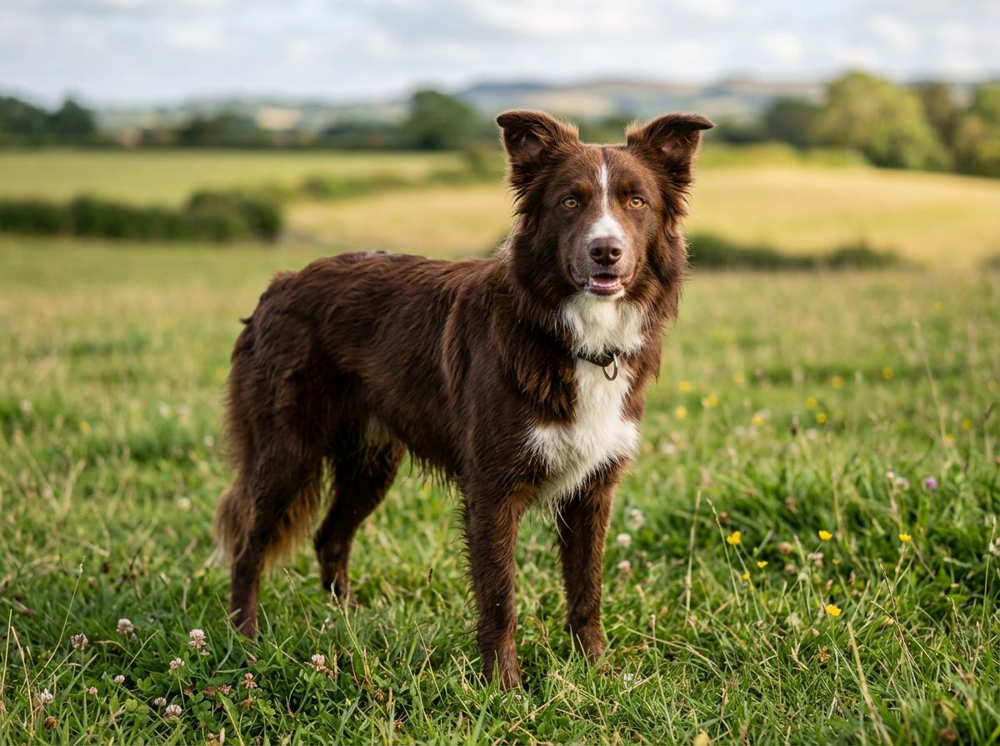
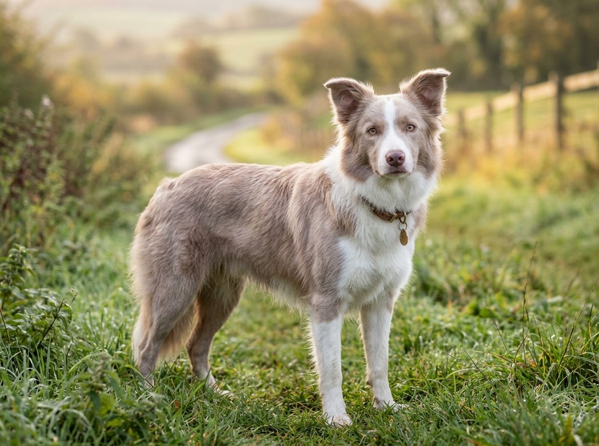
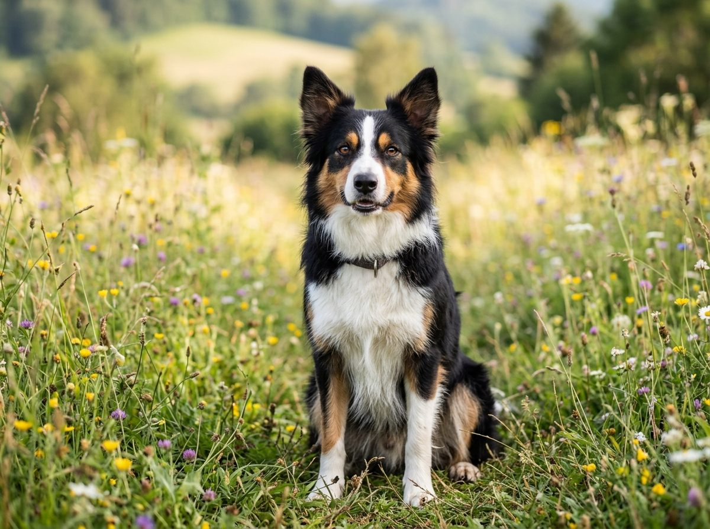
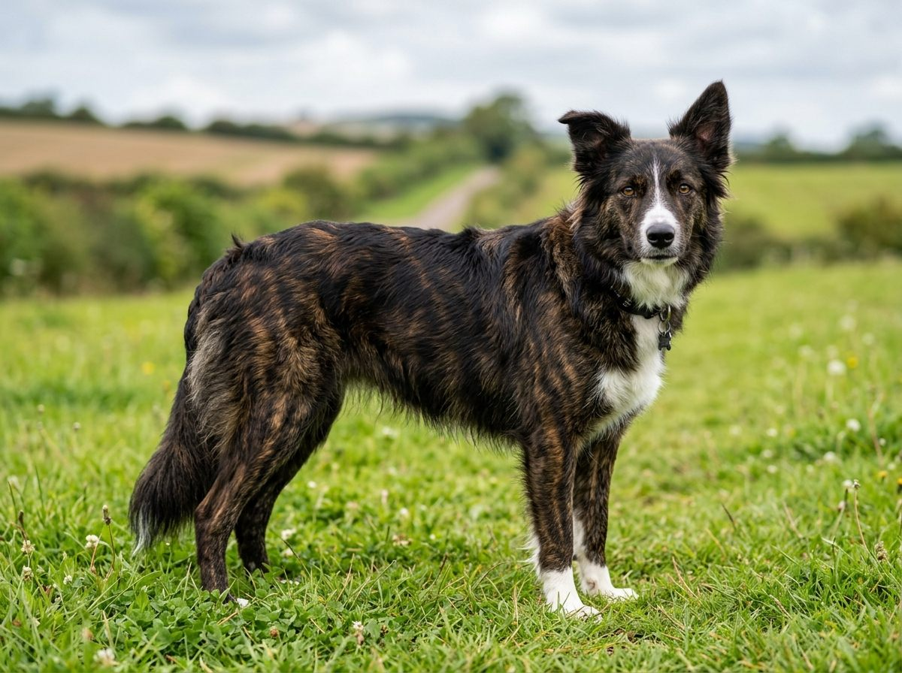
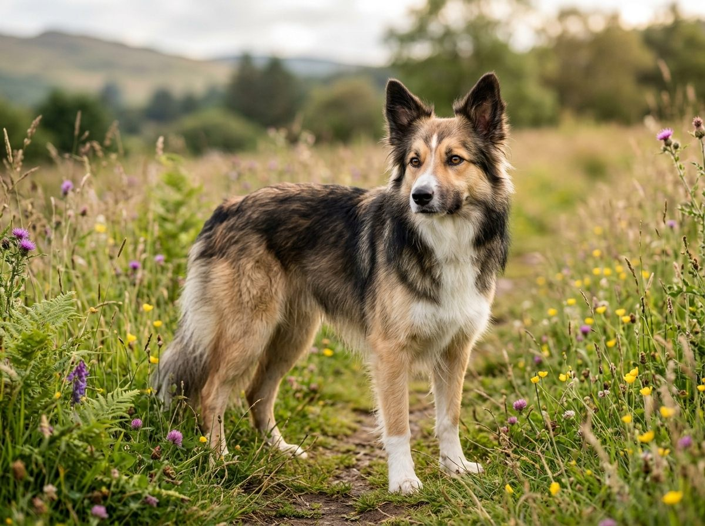

**2026년 9월 10일 기준** — 모색별 분양 시세처럼 시간이 지나면 바뀌는 정보를 다루고 있으니, 읽는 시점과 차이가 있을 수 있습니다.

본문의 색상별 사진은 무늬를 정확히 보여드리기 위해 AI로 생성한 이미지입니다. 실제 개는 사진보다 무늬 넓이나 농도 차이가 훨씬 큽니다.

성격·운동량·유전병 같은 품종 기본 정보는 [보더콜리 품종 가이드](/breeds/border-collie/)에 있고, 이 글에서는 색상만 깊게 다룹니다.

## 빠른 답

- **가장 흔한 색은?** 블랙 앤 화이트(검흰)입니다. 전체 개체의 대다수고, 이 사이트 주인공 '딱지'도 이 색입니다.
- **시세가 가장 높은 색은?** 블루머르입니다. 인기에 비해 개체 수가 적어 2026년 9월 기준 60만~80만원대 이상으로 형성됩니다.
- **색에 따라 성격이 다른가요?** 그렇다는 과학적 근거는 없습니다. 색으로 성격이나 건강을 고르지 않는 것이 좋습니다.
- **머르×머르 교배는?** 하면 안 됩니다. 자견 각각이 25% 확률로 '더블머르'가 되고, 청각·시각 이상 위험이 큽니다(AKC).

## 색상 한눈에 보기

| 색상 | 무늬 특징 | 코·눈 포인트 | 흔한 정도 |
| --- | --- | --- | --- |
| 블랙 앤 화이트 | 검은 바탕 + 흰 블레이즈·가슴·다리 | 검은 코 | 압도적으로 흔함 |
| 블루머르 | 잿빛 바탕에 검은 패치가 번짐 | 검은 코, 파란 눈·오드아이 가능 | 인기 높고 다소 희소 |
| 레드머르 | 크림 바탕에 적갈색 패치가 번짐 | 갈색(리버) 코 | 희소 |
| 초콜릿 | 온몸이 진한 갈색 | 갈색 코·입술 | 희소 |
| 라일락 | 옅은 은회갈색 | 분홍빛 갈색 코 | 매우 희소 |
| 삼색 | 검은 바탕 + 흰 무늬 + 황갈색 포인트 | 검은 코 | 흔한 편 |
| 브린들 | 검은 바탕에 갈색 줄무늬 | 검은 코 | 희소 |
| 세이블 | 밝은 바탕에 털끝이 검게 물듦 | 검은 코 | 희소 |

## 블랙 앤 화이트 — 떠올리는 바로 그 색

검은 바탕에 이마를 가로지르는 흰 줄(블레이즈), 흰 가슴과 흰 발이 얹힌 조합입니다. '보더콜리 하면 이 색'일 만큼 대표적이고, 실제 개체 대다수가 검흰입니다. 목장에서 일하던 전통적인 모습도 주로 이 색이었습니다.

구분 포인트는 '검은색과 흰색만 있다'는 것입니다. 눈썹 위나 볼에 황갈색이 조금이라도 있으면 삼색이고, 회색 얼룩이 섞여 있으면 블루머르입니다.

## 블루머르 — 한국에서 시세 높은 인기색

머르 유전자가 검은 털을 번지게 만든 색입니다. 검은색이 있어야 할 자리가 잿빛 회색으로 흐려지고, 원래의 검은색이 얼룩덜룩한 패치로 남습니다. 한 번 보면 "아, 머르"라고 알 수 있을 만큼 인상적인 무늬입니다.

구분 포인트는 코 색입니다. 털이 아무리 회색처럼 보여도 코는 검은색입니다. 파란 눈이나 한쪽만 파란 오드아이가 나타나기도 하는데, 머르 유전자의 영향입니다.

한국에서 인기가 특히 높아 검흰보다 시세가 높게 형성됩니다(2026년 9월 기준 60만~80만원대 이상). 다만 예쁜 색이 품질을 보증하지는 않으니, 아래 '더블머르' 단락까지 읽고 분양을 판단하세요.

## 레드머르 — 붉게 번진 머르

머르 무늬가 갈색 계열에 적용된 색입니다. 크림·연황색 바탕에 적갈색 패치가 번져 있습니다. 블루머르만 '머르'로 불리는 건 아니고, 레드머르도 같은 유전자로 생기는 무늬입니다.

구분 포인트는 검은 털이 전혀 없다는 점입니다. 검은 색소가 갈색으로 바뀐 개체라서 코·눈꺼풀·입술까지 전부 갈색(리버)입니다. "머르 같은데 코가 갈색"이면 레드머르라고 보면 됩니다.

## 초콜릿 — 통째로 갈색

몸 전체가 진한 초콜릿 갈색인 색입니다. 흰 가슴이나 블레이즈가 함께 있는 경우가 많습니다.

구분 포인트는 코·입술·눈꺼풀이 모두 갈색이라는 것입니다. 검은 털이 하나도 섞이지 않으며, 얼룩덜룩한 패치 없이 고르게 갈색이라는 점에서 레드머르와 갈립니다.

## 라일락 — 희석된 초콜릿

초콜릿 색이 희석 유전자로 더 옅어진 색입니다. 은빛이 도는 연한 회갈색이고, 빛 각도에 따라 분홍빛까지 보입니다.

구분 포인트는 분홍빛 갈색 코입니다. 같은 갈색 계열이라도 코가 진한 갈색이면 초콜릿이지 라일락이 아닙니다.

한국에서 만나기 가장 어려운 색에 속합니다. 그만큼 희소성을 앞세운 육종이 붙기 쉬우니, 색보다 부모견 건강 검사를 먼저 확인하는 것이 좋습니다.

## 삼색 — 검흰에 황갈색 포인트

검은 바탕과 흰 블레이즈·가슴에, 눈썹 위·볼·다리에 황갈색(탄) 포인트가 얹힌 조합입니다.

구분 포인트는 눈썹 위의 작은 황갈색 점입니다. 멀리서는 검흰과 구분이 어렵지만, 눈썹 위를 보면 바로 알 수 있습니다.

## 브린들 — 줄무늬

검은 바탕에 갈색·적갈색 줄무늬가 호랑이 무늬처럼 그어진 색입니다. 줄이 다리와 옆구리에 뚜렷하게 나타납니다.

구분 포인트는 '번진 얼룩이 아니라 방향이 있는 줄'이라는 것입니다. 줄의 굵기와 간격은 개마다 제각각이라 기계적으로 똑같은 줄무늬는 없습니다.

## 세이블 — 털끝이 검게 물든 그라데이션

크림·황갈색 바탕에 털 끝만 검게 물든 색입니다. 등과 꼬리 쪽이 진하고 얼굴·다리로 갈수록 밝아지는 그라데이션이 특징입니다.

구분 포인트는 빛 각도에 따라 전체 톤이 달라 보인다는 것입니다. 멀리서는 단색 갈색으로 보이기도 하지만, 가까이서 보면 털 하나하나의 끝이 검습니다.

## 머르×머르 교배, '더블머르' 문제

머르 무늬의 개는 머르 유전자를 하나만 가진 개체입니다. 블루머르와 블루머르, 또는 블루머르와 레드머르처럼 머르끼리 교배하면, 태어나는 자견 각각이 25% 확률로 머르 유전자를 두 개 가진 '더블머르'가 됩니다(AKC).

더블머르는 주로 흰색이 우세한 외모가 되고, 청각·시각 이상 위험이 큽니다. AKC 역시 머르끼리의 교배를 권장하지 않는다고 명확히 밝히고 있습니다. 블루머르 분양을 알아본다면 부모견이 머르×머르 조합이 아닌지 반드시 확인하세요.

참고로 AKC 보더콜리 표준은 모든 색을 허용하되 흰색이 전체에서 우세하지 않아야 한다는 조건만 답니다. 흰 색소가 많은 개체에서 유전성 난청이 알려져 있어(AKC), 색을 가리는 이 규정에도 건강이 이유로 들어 있습니다.

## 모색별 분양 시세 (2026년 9월 기준)

품종 가이드와 같은 기준입니다. 개체차가 크고 계절·지역에 따라서도 움직이니 참고선으로만 봅니다.

| 모색 | 시세 참고 |
| --- | --- |
| 블랙 앤 화이트·삼색 등 흔한 모색 | 대략 30만~60만원대 |
| 블루머르 | 60만~80만원대 이상 |
| 레드머르·초콜릿·라일락·브린들·세이블 | 희소 모색 — 개체차가 커서 일률적인 시세가 형성되지 않음 |
| 혈통·대회 라인 | 80만원 이상 |

희소 색은 구하기 어려워 값이 오르는 것이지, 색이 품종의 우열을 말하지는 않습니다.

## 색상과 성격·건강은 무관하다

"블루머르는 순하다더라", "검흰이 일을 잘한다더라" 같은 이야기가 돌지만, 색이 성격을 결정한다는 과학적 근거는 없습니다. 성격은 부모견의 기질과 사회화·환경이 만듭니다.

건강도 마찬가지입니다. 단, 위에서 본 더블머르의 청각·시각 문제는 예외로, 이는 '색의 우열'이 아니라 교배의 문제입니다. 모색은 취향대로 고르되, 건강은 색이 아니라 CEA·MDR1 같은 유전검사로 확인하세요([보더콜리 품종 가이드 — 흔한 유전병](/breeds/border-collie/)).

## 자주 묻는 질문

### 보더콜리 색상은 모두 몇 가지인가요?

AKC 표준은 모든 색을 허용합니다. 이 글의 8가지가 대표 조합이고, 여기에 흰 무늬의 넓이와 눈 색까지 더하면 조합은 사실상 무수히 많습니다.

### 블루머르는 왜 비싼가요?

개체 수가 적은 데다 인기가 높아 수요가 공급을 누르기 때문입니다. 2026년 9월 기준 60만~80만원대 이상에 형성됩니다. 다만 색이 예쁘다는 것과 건강하다는 것은 별개이니 유전검사 확인이 먼저입니다.

### 머르끼리 교배하면 왜 안 되나요?

자견 각각이 25% 확률로 더블머르가 되고, 더블머르는 청각·시각 이상 위험이 큽니다(AKC). 머르 색 개체끼리는 교배하지 않는 것이 원칙이고, 분양받을 때 부모견 조합을 확인하세요.

### 파란 눈 보더콜리는 건강에 문제가 있나요?

머르 개체의 파란 눈은 유전자에 따라 자연스럽게 나타나는 것으로, 파란 눈 자체가 병은 아닙니다. 다만 파란 눈을 얻으려는 교배가 무분별한 머르 조합으로 이어질 수 있어 바람직하지 않습니다. 눈 건강이 걱정되면 CEA 검사를 받아 보세요.

### 희귀 색은 더 아프다는 말이 사실인가요?

색 자체가 질병을 부르지는 않습니다. 다만 희귀 색에 대한 수요가 좁은 유전자 풀 안의 교배로 이어질 수 있어, 색이 희소할수록 부모견 검사를 꼼꼼히 봐야 합니다.

## 출처

- [AKC — Border Collie 품종 정보](https://www.akc.org/dog-breeds/border-collie/) (모든 색 허용, 흰색 우세 제한)
- [AKC — What Makes the Merle in Dog Coats?](https://www.akc.org/expert-advice/dog-breeding/merle-in-dogs/) (머르 유전자와 더블머르의 청각·시각 문제)
- [AKC — Blind and Deaf Dog Defies Odds](https://www.akc.org/expert-advice/training/blind-and-deaf-dog-achieves-akc-trick-dog-title-and-educates-in-the-process/) (머르×머르 교배 시 자견당 25% 확률)
- [AKC — Deafness in Dogs](https://www.akc.org/expert-advice/health/deafness-in-dogs/) (흰 색소와 유전성 난청의 관계)
- 분양 시세: 2026년 9월 분양 게시물 참고 — [보더콜리 품종 가이드](/breeds/border-collie/) 시세표와 같은 기준
- 본문 사진: AI 생성 이미지(gemini-3.1-flash-image), 발행 전 사람이 검수
