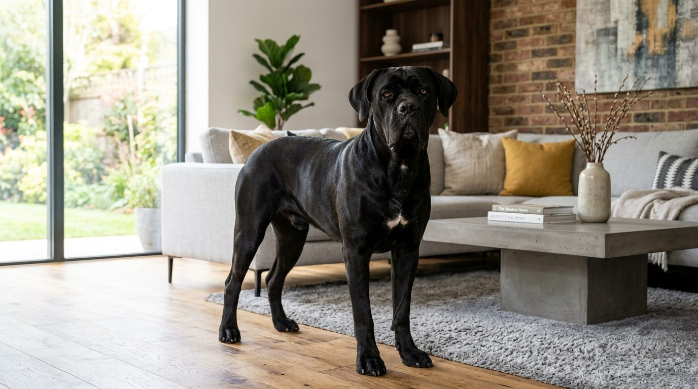
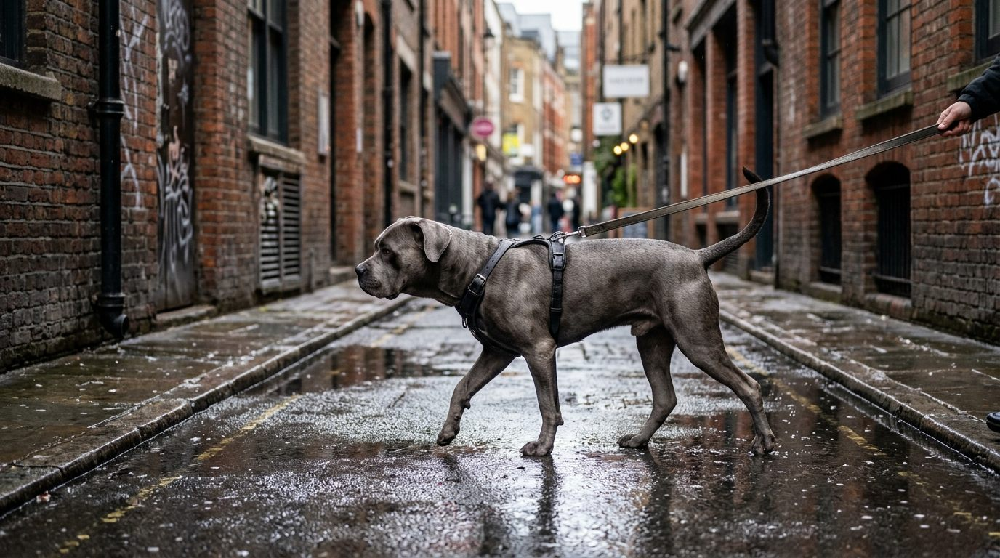
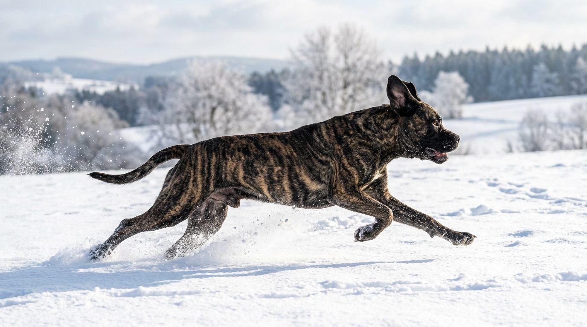

**2026년 10월 2일 기준**

"카네코르소는 검은색 아닌가요?" — 품종 사진으로 워낙 검은 거구가 자주 보이니 그렇게 알기 쉽다. 그런데 표준 모색은 검정 하나가 아니라 넉넉히 네 계열이다. 이 글은 [카네코르소 품종 허브](/breeds/cane-corso/)의 모색 부분을 확장해, 색상만 깊게 들어간다.

## 빠른 답

**"카네코르소 색상 종류에는 뭐가 있나요?"**

표준 모색은 네 계열이다. 검정(블랙), 회색(그레이), 포운(연한 황갈색), 브린들(줄무늬). 브린들은 줄 농도에 따라 브린들·블랙브린들·그레이브린들로 세분된다. 포운에는 검은 마스크가 기본이고, 가슴·발끝·콧등에 작은 흰 반점까지가 표준이 허용하는 범위다.

## 표준 모색 4계열 도감

### 검정 (블랙)

가장 먼저 떠오르는 색이다. 짧고 굵은 털에 윤기가 흘러 어디에 놓여도 존재감이 크다. 새끼 때 털끝에 회색빛이 살짝 섞여 있다가 성견이 되며 색이 짙어지기도 한다. 가슴에 흰 점이 있는 개체가 적지 않은데, 이는 표준이 허용하는 범위 안이다.

### 회색 (그레이·블루)

'블루 카네코르소'라는 이름으로 불리며 귀해 보이지만, FCI·AKC 모두 표준 모색으로 두고 있다. 검정이 옅게 희석된 톤이라 햇빛 아래서 회색빛이 돌고, 코와 발바닥의 색소도 어두운 회색이다. 새끼 때는 짙은 회색이었다가 자라며 톤이 정돈되는 개체가 많다.

색을 옅게 만드는 희석 유전과 피부 트러블의 연관은 다른 품종의 희석색 개체(블루 도베르만 등)에서 보고된 바 있다. 회색이라고 다 그런 것이 아니니 걱정할 일은 아니고, 목욕을 잦게 하기보다 평소에 피부 상태를 관찰하는 편이 안전하다.

### 포운 (레드·체스넛 포함)

연한 황갈색 바탕에 검은 마스크가 시선을 잡는 조합이다. AKC는 붉은 기가 도는 개체를 레드·체스넛으로 따로 등록한다. 마스크는 눈 주위부터 콧등까지 이어지는 게 정형이다. 조명과 계절에 따라 보이는 톤 차이가 커서, 같은 개체도 사진 조건에 따라 다르게 보이는 색이다.

### 브린들 (호피)

포운 바탕에 검은 줄무늬가 내리친 무늬다. 줄이 또렷하면 브린들, 줄 사이 바탕이 거의 안 보일 만큼 짙으면 블랙브린들, 회색 계열 줄무늬면 그레이브린들이라 부른다. 줄 무늬의 농도는 같은 배에서도 제각각이라, 어릴 때 최종 무늬를 단정하기 어렵다.

### 포멘티노

포운이 더 옅게 희석된 색이다. 바탕이 연한 회갈색이고 마스크도 검정이 아니라 회색이다. 사진으로는 밝은 포운과 헷갈리기 쉬운데, 마스크 색이 가장 빠른 구분 포인트다. 별도 품종이 아니라 포운의 희석형이다.

## 모색 비교표

| 모색 | 겉모습 | 마스크 | 표준 등록 |
|---|---|---|---|
| 블랙 | 전신이 윤기 있는 검정 | 없음 | FCI·AKC |
| 그레이(블루) | 검정이 희석된 회색 톤 | 옅은 회색 | FCI '그레이' · AKC '그레이' |
| 포운 | 연한 황갈색 | 검정 | FCI '포운' · AKC '포운·레드·체스넛' |
| 브린들 | 황갈색 바탕에 검은 줄무늬 | 검정 | FCI '브린들·블랙브린들' · AKC '브린들·블랙브린들·그레이브린들' |
| 포멘티노 | 포운의 희석형, 연회갈색 | 회색 | 포운 계열로 취급 |

## 마스크와 흰 반점 — 표준이 허용하는 선

모색을 이야기할 때 마스크와 흰 반점을 함께 봐야 한다. 포운 계열에는 마스크가 따르는데, 포멘티노는 여기서 마스크까지 옅어진 형태다. 흰 반점은 가슴·발끝·콧등의 작은 범위까지만 허용된다. 그보다 흰색이 넓게 번진 개체는 표준에서 벗어나 쇼 링에서 실격 처리된다. 반려견으로 함께 사는 데는 아무 지장이 없다는 점은 분명히 해 둔다.

## 모색별 수명 통계 — 브린들이 오래 산다?

2017년 발표된 연구가 25개국 232마리 카네코르소의 기록을 모아 모색별 수명을 비교했다.

| 모색 | 중앙 수명 |
|---|---|
| 블랙브린들 | 10.30년 |
| 브린들 | 10.13년 |
| 그레이브린들 | 9.84년 |
| 포운 | 9.01년 |
| 블랙·그레이 | 9년 안팎으로 짧았다 |

품종 전체의 중앙 수명은 9.29년이었다. 줄무늬가 들어간 개체가 단색보다 오래 산 셈이다.

다만 이 숫자는 상관 관계다. 줄무늬 유전자가 수명을 늘려 준다는 인과 증명이 아니고, 232마리라는 표본도 품종 전체에 견주면 크지 않다. '오래 사는 색'을 분양 문구로 쓰는 브리더가 있다면 걸러 들을 이야기다. 색을 고르는 기준보다는 허브 글에서 정리한 유전병 관리를 챙기는 편이 훨씬 실질적이다.

## 회색(블루)은 희귀색이 아니다

- FCI·AKC 표준 모색이다. 별종처럼 '블루 카네코르소'로 부르며 값을 올리는 매물이 있는데, 색 자체는 표준 안에 있다.
- 국내에는 모색별 분양 시세를 집계한 공개 자료가 없다. 회색이라는 이유만으로 붙는 프리미엄이 얼마인지 검증할 방법이 없다는 뜻이기도 하다.
- 진짜 조심할 것은 표준 밖 색이다. 이사벨라·스트로 같은 옅은 색이나 흰색이 넓게 번진 개체를 '레어 컬러'라며 내세우는 매물은 쇼에서 실격되는 모색이고, 색만 노린 번식이 뒤따를 수 있다.

## 분양 현장에서 색 대신 확인할 것

- 부모견의 고관절·팔꿈치 검사 결과 — 모색보다 함께할 세월의 질에 직결된다
- 새끼와 성견 사이의 색 변화 — 회색·포운 계열은 톤 변화 폭이 크다
- 흰 반점의 위치 — 가슴·발끝·콧등의 작은 점은 표준 안, 그 이상은 쇼 실격
- 마스크 색 — 밝은 포운과 포멘티노를 가르는 가장 빠른 포인트

## 자주 묻는 질문

### 카네코르소에서 가장 흔한 색은 뭔가요?

검정과 브린들 계열이 눈에 가장 많이 띕니다. 대형 마스티프의 인상이 강한 품종이라 검정 개체가 홍보 사진에 자주 등장하기도 합니다.

### 회색(블루) 카네코르소는 표준 모색인가요?

네. FCI는 그레이로, AKC는 그레이·그레이브린들로 표준 모색에 두고 있습니다. 별도 품종도, 결격 색도 아닙니다.

### 포멘티노는 어떻게 구분하나요?

마스크 색이 가장 빠릅니다. 포운은 검은 마스크, 포멘티노는 회색 마스크에 바탕도 연회갈색으로 옅습니다. 포운이 희석된 형태라 별도 품종은 아닙니다.

### 흰 반점이 있으면 안 되는 건가요?

가슴·발끝·콧등의 작은 반점까지는 표준이 허용합니다. 흰색이 넓게 번진 경우만 표준에서 벗어나 쇼에서 실격 처리되며, 반려견으로 키우는 데는 지장이 없습니다.

### 어떤 색이 오래 사나요?

2017년 연구에서는 블랙브린들이 중앙 10.30년으로 가장 길었고, 브린들 계열이 단색보다 오래 살았습니다. 상관 관계 수준의 통계이므로 색으로 수명을 보증받을 수는 없습니다.

## 출처

- [Longevity of Cane Corso Italiano dog breed and its relationship with hair colour (2017)](https://pmc.ncbi.nlm.nih.gov/articles/PMC5475242) (25개국 232마리 기록 — 모색별 중앙 수명: 블랙브린들 10.30년, 브린들 10.13년, 그레이브린들 9.84년, 포운 9.01년, 전체 중앙 9.29년)
- [Brindle Cane Corsos Live Longer — Modern Molosser](https://www.modernmolosser.com/brindle-cane-corsos-live-longer-coat-color-affects-longevity) (블랙브린들이 모색 중 최장 수명, 브린들 계열이 단색보다 길다는 연구 해석)
- 표지·본문 이미지는 AI로 생성한 실사 스타일 일러스트입니다.
