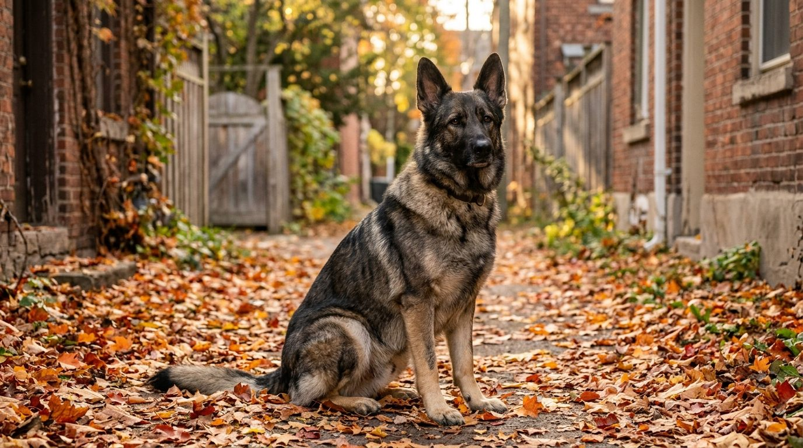

**2026년 10월 2일 기준** — 분양가처럼 변동이 큰 정보는 이 날짜를 기준으로 읽는다.

## 빠른 답

- **성격 한 줄**: 가족에게는 헌신적이고 낯선 사람에게는 경계하는, 한번 마음을 정한 주인을 오래 따르는 대형견이다.
- **아파트에서 키울 수 있나?**: 법적 제한은 없다. 다만 체구가 크고 운동 요구량이 높아, 하루 두 번 산책과 두뇌 자극을 꾸준히 감당할 수 있을 때만 가능하다.
- **처음 키우는 사람에게 맞나?**: 쉽지 않다. 지능과 체력이 워낙 좋아서 사회화와 훈련 경험이 없으면 다루기 버겁다.

## 품종 개요

세퍼트의 정식 이름은 저먼 셰퍼드(German Shepherd)다. 1899년 독일의 기병 장교 막스 폰 슈테파니츠가 독일 각지에 흩어져 있던 목양견을 하나의 표준으로 묶으면서 탄생했다. 첫 표준 등록견은 호란트 폰 그라프라트라는 수컷으로, 이 개가 오늘날 모든 세퍼트의 조상이 됐다.

스테파니츠가 가장 중시한 것은 일하는 능력이었다. 그래서 세퍼트는 목양견에서 출발해 군견·경찰견·구조견·안내견으로 쓰임을 넓혔다. 복종성, 후각, 체력, 집중력을 두루 갖춘 대표적인 만능 실용견이다.

한국에는 '세퍼트'라는 이름으로 알려졌다. Shepherd를 옮긴 표기가 굳어진 것으로, 군견·경찰견으로 이름이 알려지며 일상 명칭이 됐다. 지금도 경찰견의 전통적인 주력 견종이다. 2015년 제주 북촌포구에서 조난 어민 구조 활동 중 숨진 뒤 순경으로 추서된 경찰견 알렉스도 세퍼트다.

| 항목 | 내용 |
| --- | --- |
| 체고(수컷) | 60~65cm |
| 체고(암컷) | 55~60cm |
| 체중(수컷) | 30~40kg |
| 체중(암컷) | 22~32kg |
| 수명 | 평균 10.3년(영국 1차 동물병원 데이터) |
| 운동량 | 하루 1~2시간 이상 + 두뇌 자극 |
| 털 관리 난이도 | 중간(이중모, 털갈이 많음) |
| 초보 적합도 | 낮음 |

체고·체중은 FCI 표준 값이다. AKC는 허딩 그룹에, FCI는 제1그룹(목양견·가축몰이견)에 분류한다.

## 성격과 기질

세퍼트는 '한 사람의 개'라는 말이 어울리는 견종이다. 가족에게 애착이 강하고 헌신적이며, 맡긴 일을 끝까지 해내는 집요함이 있다. 대신 낯선 사람에게는 경계심부터 발동한다. 번견으로는 최상급이고, 그래서 사회화가 특히 중요하다.

지능은 최상위권이다. 견종 지능 순위를 다루는 자료에서 대체로 보더콜리·푸들과 함께 3위 안에 인용된다. 배움이 빠르다는 것은 양날의 검이라, 원하지 않는 행동도 빠르게 익힌다. 훈련의 일관성이 없으면 주인보다 개가 상황을 판단하게 된다.

일할 이유가 없으면 지루함으로 괴로워한다. 파괴적인 발산으로 이어지기 쉽고, 좁은 공간에만 두면 신경질적으로 변한다. 매일 쓸 수 있는 에너지와 머리를 쓸 과제를 주는 것이 세퍼트 관리의 뼈대다.

다른 개와의 관계는 사회화에 달려 있다. 어릴 때부터 다양한 개·사람·환경을 접하면 무난하지만, 그 과정이 부족하면 같은 성별의 대형견을 특히 견제하는 성향이 드러난다. 영국 1차 동물병원 데이터에서도 공격성은 세퍼트의 흔한 기록 항목 중 하나였다.

## 털무늬·색상 변형

세퍼트의 모색은 크게 네 갈래로 본다.

- **안장(saddle)** — 등에 검은 안장 모양이 얹히고 배·다리·눈 주변이 황갈색인, 가장 대표적인 모색이다. '세퍼트 하면' 떠오르는 그 색이다.
- **바이컬러(bicolor)** — 검은 영역이 안장보다 훨씬 넓게 퍼진 모색이다. 다리까지 거의 검게 들어온다.
- **사색(sable)** — 털 끝이 검게 그을린 회갈색으로, 늑대 털과 비슷하다. 워킹라인에 많고 색 농도가 개체마다 크게 다르다.
- **순흑(solid black)** — 온몸이 검은 모색으로, 표준 안에 있는 정식 모색이다.

흰색은 표준 모색이 아니다. FCI 표준에서 흰 털은 실격 사유이고, 하얀 개는 화이트 셰퍼드·스위스 화이트 셰퍼드라는 별도 품종으로 갈라져 있다. '흰 세퍼트' 매물은 품종을 확인해 볼 필요가 있다.

라인에 따른 외형 차이도 크다. 도그쇼 중심의 쇼라인은 등선이 뒤로 기울고(슬로프 백) 걸음이 낮게 미끄러지는 반면, 실무 중심의 워킹라인은 등이 곧고 체구가 다부지다. 과장된 슬로프 백이 고관절·척추에 불리하다는 논란이 꾸준히 이어져 왔다. 모색별 도감은 별도 글로 따로 다룬다.

## 한국에서 키울 때

### 분양가

공신력 있는 국내 시세 집계는 없다. 블로그 참고치 두 건을 나란히 싣는다.

| 출처 | 참고 가격대 |
| --- | --- |
| 네이버 블로그 A | 100만~200만 원, 우수 혈통은 300만 원 이상 |
| 네이버 블로그 B | 60만 원대부터 200만 원 초과까지 |

두 참고치의 폭이 큰 이유는 혈통서, 접종 이력, 부모견 검증 여부가 가격에 그대로 반영되기 때문이다. 독일 혈통을 직접 들여온 전문 견사나 훈련 검증을 거친 개체는 이보다 높다. 반대로 60만 원 이하 매물은 혈통·건강 검증이 빠져 있을 가능성이 크다. 분양 전에 부모견의 고관절 검사 결과를 직접 확인하자.

성견 입양도 현실적인 대안이다. 세퍼트는 성격이 다 드러난 뒤에 만나는 편이 오히려 판단이 쉽고, 보호소·파양 게시판을 통해 만날 수 있다.

### 법정 맹견이 아니다

동물보호법이 정한 맹견 5종은 토사견, 아메리칸 핏불 테리어, 아메리칸 스태퍼드셔 테리어, 스태퍼드셔 불 테리어, 로트와일러다. 세퍼트는 여기에 없다. 법정 입마개 의무도 없다. 다만 지자체 조례나 숙박·시설 이용 규정에서 별도 요구가 있을 수 있으니 [강아지 입마개 가이드](/guides/dog-muzzle/)를 참고한다.

다만 '법적 제한이 없다'와 '아무나 키운다'는 다른 이야기다. 대형견의 물리적 힘과 경계심을 감안하면, 사회화와 복종 훈련은 선택이 아니라 의무에 가깝다.

### 아파트 적합성

조건부다. 몸집이 크고 에너지가 많아 공간과 운동이 관건이다. 경계심 높은 견종이라 복도·엘리베이터에서 다른 사람·개와 마주치는 상황을 미리 연습해 둬야 하고, 창밖 자극(지나가는 사람·차)에 계속 반응하게 두면 짖음이 자리 잡는다. 하루 산책 두 번과 실내 두뇌 놀이를 충족할 수 있다면 아파트라고 못 키울 이유는 없다.

### 여름나기

이중모에 체구가 큰 견종은 더위에 취약하다. 여름에는 산책을 이른 아침·해 진 뒤로 옮기고, 아스팔트 온도를 손등으로 확인한 뒤 나간다. 상시 그늘과 물을 두고, 헐떡임이 오래 가면 실내 온도부터 낮춘다.

### 흔한 유전병

영국 왕립수의대(RVC)의 VetCompass 연구는 세퍼트의 평균 수명을 10.3년으로 집계했고, 사망 원인 기록의 1위가 관절 질환(16.3%), 2위가 기립 불가(14.9%)였다. 세퍼트의 약점이 관절과 척추라는 사실을 보여주는 숫자다.

| 질환 | 무엇인가 | 초기 신호 |
| --- | --- | --- |
| 고관절 형성부전 | 고관절이 헐거워져 아프고 관절염으로 진행하는 유전성 질환 | 절뚝임, 두 뒷다리를 모아 뛰기 |
| 퇴행성 척수병증(DM) | 노년에 척수가 서서히 퇴행해 후지가 마비되는 질환 | 발끝 끌기, 뒷발이 미끄러지는 느낌 |
| 위염전(GDV) | 위가 가스로 찬 뒤 뒤틀리는 응급 질환. 가슴이 깊은 대형견에 많다 | 헛구역질, 배 팽만, 안절부절못함 |
| 췌장 외분비 기능부전(EPI) | 소화효소가 부족해 먹은 것을 흡수하지 못하는 질환 | 잘 먹는데 마르고 설사가 잦음 |
| 혈관육종 | 비장·심장 등에 잘 생기는 암. 파열되면 급격히 위태롭다 | 원인 모를 무기력, 갑작스러운 실신 |

위염전은 예방 수칙이 분명하다. 한 끼를 크게 주기보다 나눠 주고, 식후 1시간가량은 격한 운동을 피한다. 고관절은 성장기 관리가 평생을 좌우한다 — 대형견 성장기 사료의 칼슘 기준은 [강아지 사료 고르기](/guides/choosing-dog-food/) 가이드에 정리해 두었다.

## 관리법

**운동** — 하루 1~2시간을 기본으로 잡고, 물리적인 운동과 두뇌 자극을 반반 섞는다. 후각 놀이, 복종 훈련, 물어오기 같은 과제가 세퍼트의 피로를 진짜로 쌓게 한다. 나이별 산책 기준과 여름 주의사항은 [강아지 산책 가이드](/guides/dog-walking/)에 있다. 성장판이 닫히는 1년 반 전후까지는 격한 조깅이나 자전거 병행을 삼간다.

**털 관리** — 이중모라서 연중 털이 떨어지고, 봄·가을 대털갈이에는 양이 두 배로 늘어난다. 빗질은 평소 주 2~3회, 털갈이 철에는 매일 한다. 삭모는 피부 문제와 색소 침착을 남길 수 있어 권하지 않는다.

**훈련·사회화** — 사회화의 결정적 시기는 대략 16주까지다. 이때 사람·개·차·소음을 폭넓게 접한 세퍼트와 그렇지 않은 세퍼트는 성견이 되었을 때 다른 개처럼 보일 만큼 갈린다. 기본 복종(앉아·기다려·부르면 오기)은 산책 안전과 직결되므로 최우선으로 완성한다.

**건강 검진** — 성견은 연 1회, 7~8세부터는 노년 검진으로 간격을 좁힌다. 평소 걸음새 변화와 배·옆구리 혹을 만져 보는 습관을 들여 둔다.

## 자주 묻는 질문

### 세퍼트는 아이와 잘 지내나요?

사회화가 된 세퍼트는 가족 아이에게 다정합니다. 다만 체중 30kg의 개가 뛰어드는 아이를 받아 넘어뜨릴 수 있어, 아이와 개를 같은 공간에 둘 때는 어른이 지켜봅니다. 아이가 개 밥그릇이나 잠자는 개를 건드리지 않는 규칙을 미리 세워 두세요.

### 처음 키우는 사람도 키울 수 있나요?

추천하지는 않습니다. 지능과 체력이 좋아 훈련이 비어 있으면 곧바로 통제가 어려워집니다. 굳이 키운다면 유치원·훈련 클래스를 처음부터 함께 다니고, 성견 입양보다 새끼부터 키우며 매일 훈련하는 편이 수월합니다.

### 털은 얼마나 빠지나요?

연중 떨어지고 봄·가을 대털갈이에는 훨씬 많아집니다. 검은 옷을 입는 각오와, 빗질을 자주 하는 습관이 필요합니다. 진공청소기를 자주 돌리는 수밖에 없는 견종입니다.

### 다른 개나 고양이와 잘 지내나요?

어릴 때부터 함께 자라면 대체로 무난합니다. 성견을 새로 들이는 경우라면 만나기 전에 다른 동물 반응을 보호자·보호소를 통해 미리 확인하는 편이 안전합니다.

### 건강 검진은 어떻게 잡나요?

성견은 연 1회 종합 검진, 7~8세부터는 반년~1년 간격으로 관절·척추·심장을 봅니다. 걸음이 달라지거나 헛구역질·배 팽만이 나타나면 바로 병원에 가야 합니다 — 위염전은 시간을 다투는 응급입니다.

## 출처

- [저먼 셰퍼드 개체 수·질환 연구(영국 왕립수의대 RVC VetCompass)](https://pmc.ncbi.nlm.nih.gov/articles/PMC5532765) — 평균 수명 10.3년, 사망 원인 기록(관절 질환 16.3%·기립 불가 14.9%) 인용
- [저먼 셰퍼드 분양 및 가격(네이버 블로그)](https://m.blog.naver.com/hs_sh73/223214039702) — 국내 분양가 참고치 인용
- [세퍼드 분양가 및 정보(네이버 블로그)](https://m.blog.naver.com/wnsqja4537/224005770518) — 국내 분양가 참고치 인용
- 표지·본문 이미지는 AI로 생성했습니다.
