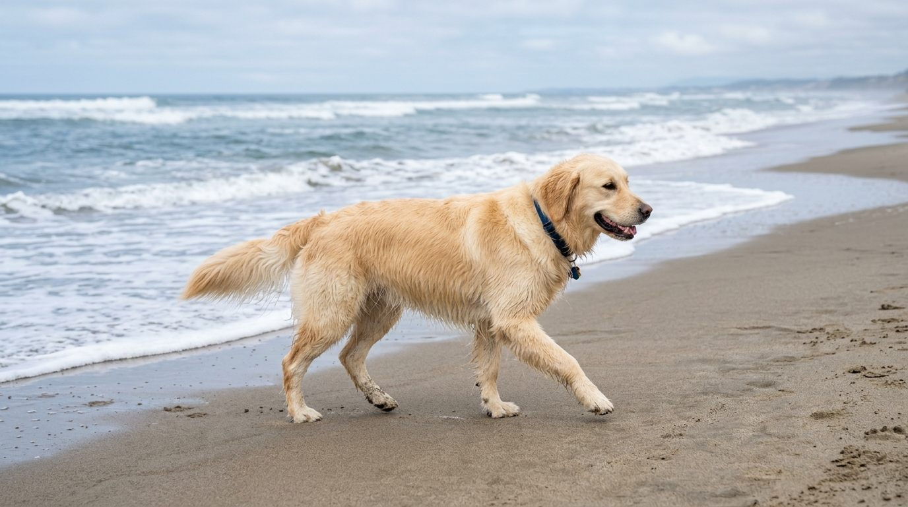
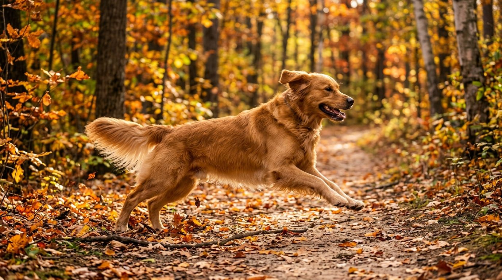
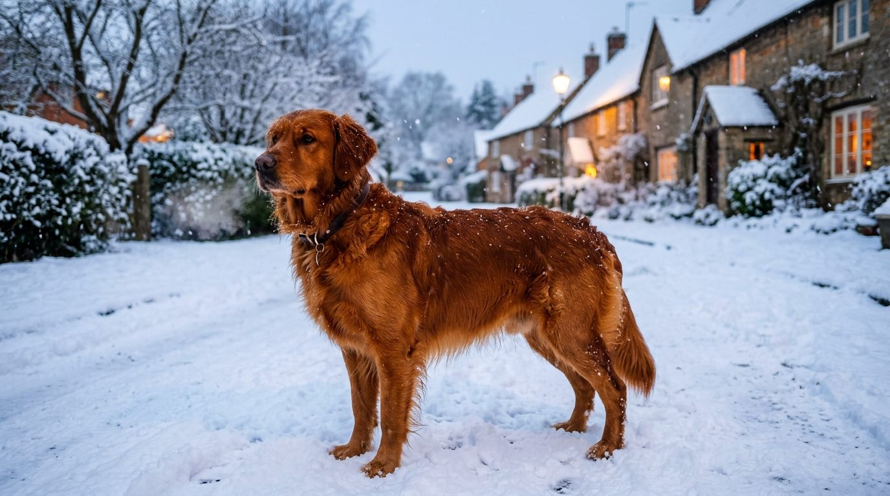

**2026년 9월 24일 기준**

## 빠른 답

**"골든 리트리버 색상 종류가 궁금하신가요?"**

AKC가 공식 등록 모색으로 분류하는 색은 **크림·라이트 골드·골드·다크 골드 4종**이다. 네 색 모두 '골드'라는 하나의 스펙트럼 안에 있는 음영 차이일 뿐, 서로 다른 품종이 아니다. '잉글리시 크림', '레드 골든', '화이트 골든' 같은 이름은 표준 밖 명칭이거나 마케팅 용어다.

## 색이 다르다고 별도 품종이 아니다

골든 리트리버 색을 검색하면 명칭이 끝없이 나온다. 영국식 크림, 플래티넘 골든, 잉글리시 화이트, 레드 골든, 마호가니. 그러나 견종 표준이 인정하는 축은 하나다. 골드에서 크림까지의 음영이다. 나머지 이름은 지역 라인의 특징을 가리키거나, 판매를 위한 수식어다.

이 글에서는 표준 4색을 이미지로 정리하고, 기관별 표준 입장 차이, '영국식 크림' 마케팅의 실체, 새끼 때 일어나는 색 변화까지 다룬다. 품종 전반은 [골든 리트리버 품종 총정리](/breeds/golden-retriever/)에서 볼 수 있다.

## 표준 모색 4색 도감

### 크림 (Cream)

가장 옅은 모색이다. 우유빛에 가까운 아이보리 톤에, 귀·꼬리·다리의 장식털도 몸과 같은 옅은 색으로 흘러간다. 영국·유럽형 쇼 라인에서 많이 본다. 국내에서 '영국식 크림 골든'으로 불리며 인기가 높은 색이기도 하다.

### 라이트 골드 (Light Golden)

크림보다 한 단계 진한 옅은 금색이다. 실내에서는 크림과 경계가 흐려 보이고, 햇빛 아래에서는 은은한 금빛이 돈다. 쇼 라인·가정견 할 것 없이 폭넓게 나오는 색이다.

### 골드 (Golden)

사람들이 골든 리트리버를 떠올리는 바로 그 중간톤이다. 풍부하고 광택 있는 금색이 견종 표준이 말하는 이상형에 가장 가깝다. 새끼부터 성견까지 색의 편차가 비교적 작은 편이다.

### 다크 골드 (Dark Golden)

진한 금색에서 구릿빛까지 내려가는 모색이다. 미국 라인과 필드(수렵) 계열에서 자주 나온다. 필드 라인에는 레드에 가까울 만큼 진한 개체도 있는데, 이쯤 되면 표준의 경계 바깥이다.

### 모색 비교표

| 모색 | 색톤 | 주로 보이는 라인 | 표준상 위치 |
|---|---|---|---|
| 크림 | 우유빛에 가까운 가장 옅은 색 | 영국·유럽형 쇼 라인 | 4색 안(백색에 가까워지면 지양) |
| 라이트 골드 | 옅은 금색 | 쇼·가정견 혼재 | AKC 등록 4색 안 |
| 골드 | 중간 금색, 대표색 | 전 라인 | 모든 표준의 중심 |
| 다크 골드 | 진한 금색~구릿빛 | 미국 라인·필드 계열 | AKC 등록 4색 안(마호가니에 가까워지면 지양) |

## 견종 표준 기관별 입장 — 같은 견종, 다른 문구

| 기관 | 표준상 모색 | 표준이 걸어 두는 색 |
|---|---|---|
| AKC(미국) | 다양한 음영의 농후하고 광택 있는 골드(등록 모색 4종) | 지나치게 옅은 색·지나치게 짙은 색 |
| 영국 KC | 골드 또는 크림의 모든 음영(가슴의 흰 털 몇 가닥만 허용) | 레드·마호가니 |
| FCI(국제) | 영국 계열 표준을 따름 | 레드·마호가니 |
| UKC(미국) | 짙고 광택 있는 골드·크림의 모든 음영 | 백색에 가까워지는 색·마호가니 |

영국 KC 문구는 2025년 4월 개정 표준 기준이다. 읽는 요점은 하나다. 어느 표준이든 색의 축은 골드~크림 하나뿐이고, 양 끝(백색 쪽과 마호가니 쪽)을 걸어 둔다. 어느 쪽으로 치우친 색을 좋다 나쁘다 할 문제는 아니지만, 쇼 링을 겨냥한다면 표준의 범위를 알아두어야 한다.

## 레드 골든·마호가니 — 표준 밖의 진한 색

레드에 가까운 진한 개체는 실제로 존재한다. 주로 미국의 필드 라인에서 나오며, 수렵 능력 위주로 번식된 혈통에서 진한 색이 따라오는 경향이 있다. 영국·국제 표준에서는 결점으로 분류되지만, 가정견으로 키우는 데 아무 문제가 없다.

주의할 점은 하나다. '레드 골든 리트리버'를 별도 품종이나 희귀 변종처럼 소개하는 판매 문구다. 견종은 골든 리트리버 하나고, 색이 표준 범위를 벗어났을 뿐이다. '희귀 종' 명목의 프리미엄은 근거가 없다.

## '영국식 크림' 마케팅 해부

국내에서 크림 모색은 '잉글리시 크림', '영국식 크림', '화이트 골든', '플래티넘 골든' 같은 이름으로 불리며 프리미엄이 붙는다. 실체를 정리하면 다음과 같다.

- **같은 견종이다.** 유럽형 쇼 라인 혈통의, 표준 모색 중 가장 옅은 개체일 뿐이다. 별도 품종 등록은 어디에도 없다.
- **'더 건강하고 오래 산다'는 주장은 근거가 부족하다.** 일부 브리더와 블로그가 내세우는 주장이며, 모색 자체가 수명이나 유병률을 좌우한다는 연구는 확인되지 않는다. 건강은 혈통 검사와 사육 환경이 결정한다.
- **오히려 표준에서 가장 자주 걸리는 색이기도 하다.** 미국 계열 표준은 백색에 가까워질수록 지양한다. '순백 골든'은 어느 표준에도 존재하지 않는다.
- **가격 프리미엄은 시장이 만든 것이다.** 아래 시세 섹션에서 다룬다.

크림이 예뻐서 고르는 것은 자연스럽다. 문제는 '희귀 종이라 더 비싸다'는 포장이다. 모색 희소성을 근거로 한 프리미엄은 견종 표준과 무관한 시장 논리다.

## 모색별 시세 경향 — 국내 업체 안내가 기준

두 국내 분양 안내 업체의 공개 가격을 나란히 싣는다(2026년 9월 확인. 실제 분양가는 혈통·검진·지역에 따라 크게 달라진다).

| 구분 | 서리펫 공개 안내가 | 도그마루 공개 안내가 |
|---|---|---|
| 일반 가정 분양 | 30만~75만 원 | 30만~40만 원 |
| 혈통 보증 라인 | 국제 혈통 80만 원~ | 혈통 인증 50만~60만 원 |
| 쇼 퀄리티·'희귀 크림' 명목 | — | 80만 원~ |

읽는 요점은 두 가지다. 첫째, 모색보다 **혈통과 라인이 가격을 결정**한다. 둘째, 크림 프리미엄은 '희귀 컬러' 명목이 붙을 때 나타나는 구조다. 같은 크림이라도 가정 분양과 혈통 라인 사이에서 가격이 갈린다. 견종 전체 시세 흐름은 [골든 리트리버 품종 총정리](/breeds/golden-retriever/)의 시세표에서 볼 수 있다.

## 새끼 때 색은 성견이 되며 바뀐다

골든 리트리버 새끼는 성장하며 모색이 상당히 달라지는 개체가 많다. 새끼 털이 성견 털로 바뀌며 밝아지거나 어두워지는 중간 단계를 지나 최종 색에 정착한다.

브리더들 사이에서는 **귀 끝 색이 성견 모색을 가장 잘 예측하는 지표**로 통용된다. 몸통의 새끼 털이 옅어 보여도 귀 색이 진하면 성견이 진해지는 경우가 많다는 경험칙이다. 과학적으로 확립된 법칙은 아니니 참고선으로만 쓰고, 분양 시점의 몸 색만 보고 성견 색을 단정하지 않는 편이 좋다.

## 블랙 골든은 존재하지 않는다

검색하면 가끔 '블랙 골든 리트리버'라는 사진이 나온다. 전부 다음 둘 중 하나다. **플랫코티드 리트리버**(검은 긴 털의 별개 견종)이거나 혼혈이다. 골든 리트리버는 유전자적으로 검은 모색이 나오지 않는 품종이다. 형태가 비슷해 헷갈리기 쉬운 리트리버 6종의 차이는 [리트리버 종류 비교](/guides/retriever-types/)에서 정리했다.

## 모색으로 성격·건강을 판단하지 않는다

'크림이 더 온순하다', '다크 골드가 더 활동적이다' 같은 속설이 따라다닌다. 모색과 성격·건강을 잇는 근거는 없다. 굳이 차이를 논한다면 그건 색이 아니라 **라인** 이야기다. 쇼 라인과 필드 라인은 체형과 에너지 수준에서 실제로 경향이 다르다.

유전병 위험도 모색이 아니라 혈통 검사로 확인하는 문제다. 골든의 대표 유전병과 검사 항목은 허브 글의 유전병 섹션에 정리해 두었다.

## FAQ

### 골든 리트리버에서 가장 흔한 색은 무엇인가요?

중간톤의 '골드'가 가장 흔히 보이는 대표색입니다. 다만 라인에 따라 편차가 커서, 유럽형 쇼 라인 쪽으로 갈수록 크림·라이트 골드 비중이 높아집니다.

### 하얀 골든 리트리버는 별도 견종인가요?

아닙니다. '화이트 골든', '잉글리시 화이트'는 크림 모색에 붙인 마케팅 명칭입니다. 순백은 골든 리트리버 표준 어디에도 없고, 오히려 미국 계열 표준에서는 가장 지양하는 쪽입니다.

### 모색이 진하거나 옅하면 건강에 영향이 있나요?

없습니다. 모색은 털 색소의 표현 차이일 뿐입니다. 건강을 좌우하는 건 혈통 검사와 사육 환경이지 색의 농도가 아닙니다.

### 새끼 때 색이 바뀌기도 하나요?

바뀌는 개체가 많습니다. 성장하며 중간 단계를 거쳐 최종 모색에 정착하며, 브리더 경험칙상 귀 끝 색이 성견 색에 가깝다고 봅니다.

### 크림 골든이 더 건강하고 오래 산다던데 사실인가요?

확인된 근거가 없습니다. 일부 브리더와 블로그의 주장일 뿐, 모색이 수명이나 유병률을 좌우한다는 연구는 찾기 어렵습니다. 색보다 부모견의 유전병 검사 기록을 확인하는 편이 훨씬 중요합니다.

## 출처

- [AKC — Golden Retriever](https://www.akc.org/dog-breeds/golden-retriever/) (품종 표준·기본 정보 확인)
- 영국 왕립켄넬클럽 견종 표준(2025년 4월 개정) — "골드·크림의 모든 음영, 레드·마호가니 제외" 문구 확인
- 국내 분양 안내 업체 공개가(서리펫·도그마루, 2026년 9월 검색 확인) — 모색·라인별 시세 대역

*표지·본문 이미지는 AI로 생성한 실사 스타일 일러스트입니다.*
