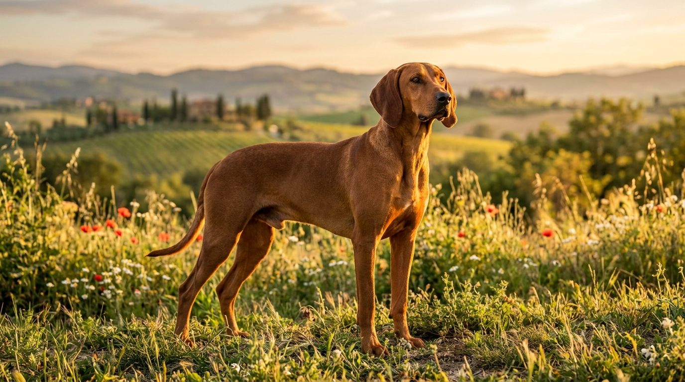
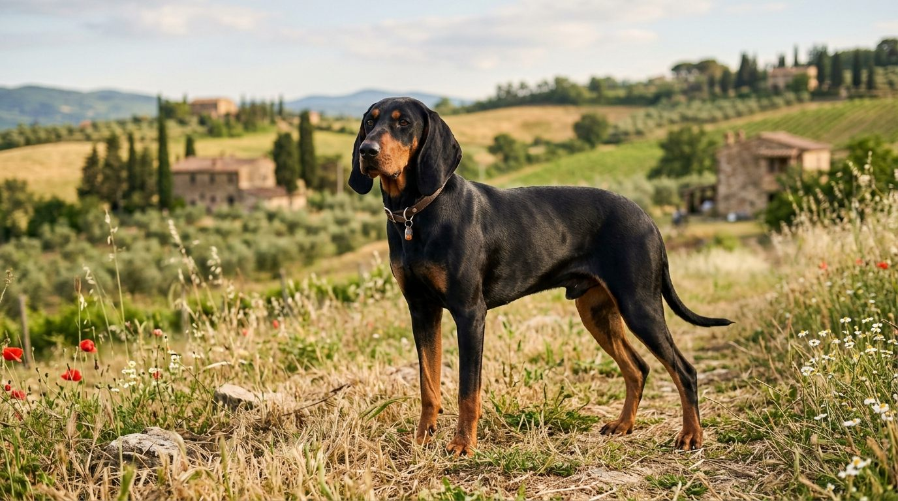
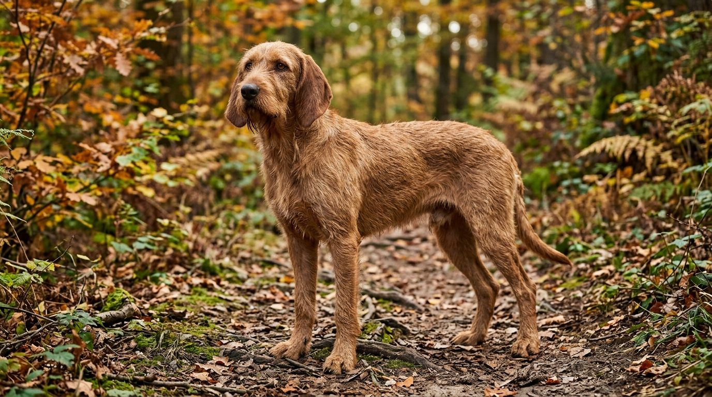
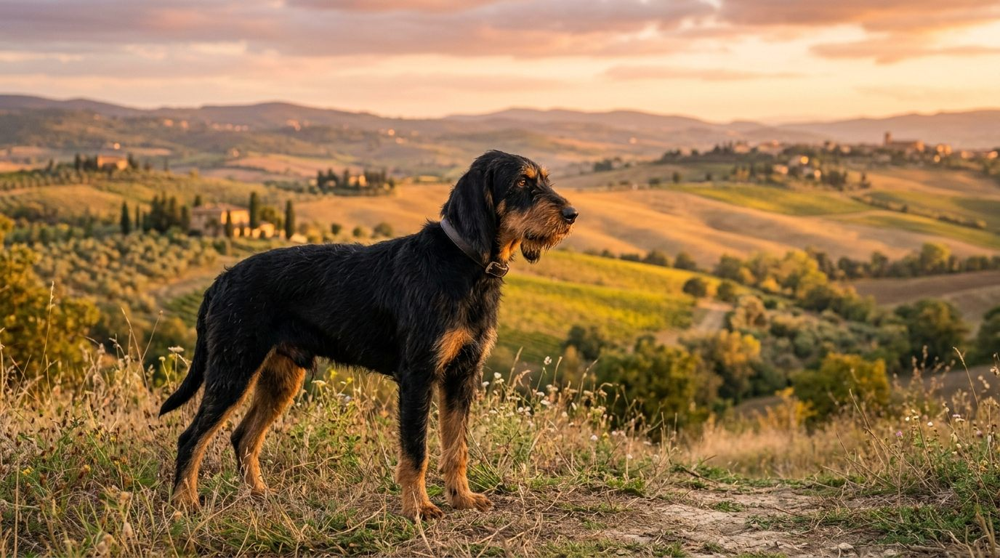

**2026년 9월 19일 기준**

## 빠른 답

**이탈리안 하운드 색상·종류는 몇 가지인가요?**

표준에 인정된 색은 **폴 계열과 블랙앤탄 두 가지**, 모질 종류는 **단모와 강모 두 가지**다. 두 축을 조합하면 실제로 만날 수 있는 외형은 네 가지로 좁혀진다. 온몸이 흰 개체는 표준에 없고, 얼굴과 가슴에 나는 작은 흰 반점만 허용된다. 견종 소개 전반은 [이탈리안 하운드 품종 허브](/breeds/italian-hound/)에 정리했다.

## 종류의 축은 모질 — 단모와 강모

'이탈리안 하운드 종류'를 검색하는 사람이 찾는 답은 대개 색보다 모질 쪽에 가깝다. 이 견종은 모질에 따라 표준을 아예 따로 갖는다. 단모가 세구조 이탈리아노 펠로 라소(Segugio Italiano a Pelo Raso, FCI 표준 337번), 강모가 펠로 포르테(a Pelo Forte, FCI 표준 198번)다. 견종 하나에 표준 문서가 두 부류로 나뉘어 있는 셈이다.

두 모질은 성격까지 크게 다르지 않다. 몸집과 외형이 거의 같고, 강모 쪽이 체구가 약간 더 크다.

| | 단모 (FCI 337) | 강모 (FCI 198) |
|---|---|---|
| 털 | 짧고 매끈하게 붙는다 | 굵고 뻣뻣하며 5cm를 넘지 않는다 |
| 체구 | 수컷 52~58cm · 암컷 48~56cm | 단모보다 약간 크다 |
| 인상 | 단정하고 매끈하다 | 거친 털이 사냥개다운 인상을 만든다 |
| 손질 | 기본 빗질이면 충분하다 | 와이어 털 특성상 트리밍이 들어간다 |

## 색상 도감 — 폴 계열과 블랙앤탄

FCI 표준이 인정하는 모색을 옮기면 이렇다. 폴(fawn)은 사슴털빛, 곧 밤색 계열이다.

> 짙은 여우빛 적갈색부터 빛바랜 듯 옅은 밤색까지, 그리고 블랙앤탄.

핵심은 폴이 하나의 색이 아니라 농담의 스펙트럼이라는 점이다. '레드폴'처럼 따로 이름이 붙은 변형이 있는 게 아니라, 한 계열 안에서 어두운 끝과 밝은 끝이 모두 표준 안에 있다.

| 모색 | 생김새 | 비고 |
|---|---|---|
| 폴 (짙은 쪽) | 여우빛에 가까운 적갈색 | 스펙트럼의 어두운 끝 |
| 폴 (옅은 쪽) | 밀색을 머금은 옅은 밤색 | 스펙트럼의 밝은 끝 |
| 블랙앤탄 | 검은 몸에 눈 위·주둥이·가슴·다리의 갈색 포인트 | 두 모질 모두에서 나온다 |

*폴 계열의 어두운 끝 — 여우빛 적갈색의 단모 개체.*

*블랙앤탄 단모 — 검은 몸에 갈색 포인트가 든다.*

흰 반점은 여기에 겹쳐 나올 수 있는 표시다. 표준은 얼굴과 가슴의 작은 흰 반점을 허용한다. 반대로 흰색이 몸의 주가 되는 개체는 표준 밖이므로, '흰색 이탈리안 하운드'를 찾는다면 그런 개체는 없다고 보는 게 맞다.

강모의 두 색도 같은 규정을 따른다. 거친 털이 덮이면 인상이 크게 달라 보이지만, 인정 모색 자체는 단모와 같다.

*폴 강모 — 뻣뻣한 털에 덮인 밤색 개체.*

*블랙앤탄 강모 — 두 축이 겹친, 만나기 쉽지 않은 조합.*

## 이름이 비슷해 헷갈리는 견종들

'이탈리안 하운드'로 검색하면 이탈리안 그레이하운드 사진이 섞여 나온다. **두 견종은 전혀 다른 개**다.

| | 이탈리안 하운드 | 이탈리안 그레이하운드 |
|---|---|---|
| 분류 | 중형 후각하운드 | 소형 시각하운드(토이견) |
| 크기 | 체고 48~58cm | 체고 30cm대 |
| 모색 | 폴 계열·블랙앤탄만 | 인정 범위가 넓은 편 |
| 원래 쓰임 | 냄새로 사냥감을 추적 | 시각으로 사냥감을 쫓았다 |

이탈리아에는 이 밖에도 토착 산하운드가 더 있다. 세구조 마레마노와 세구조 델아펜니노가 그것으로, 같은 뿌리의 사냥개 계열이지만 이탈리안 하운드와는 별개 견종으로 다뤄진다. 하운드 계열 전체의 구분은 [하운드 종류 가이드](/guides/hound-types/)에 정리했다.

## 한국에서 색을 고른다는 것

이탈리안 하운드는 국내 분양 시세 데이터가 잡히지 않는 견종이다. 모색별 가격 차를 논할 시장 자체가 없다는 뜻이고, "블랙앤탄이 더 비싸다" 같은 말은 근거를 확인할 수 없다.

수입을 알아본다면 색 선택지가 두 가지뿐이라는 점이 오히려 기준을 단순하게 만든다. 모색보다 먼저 따질 것은 이렇다.

1. **모질** — 강모의 와이어 털은 스스로 잘 빠지지 않아 정기적인 트리밍이 들어간다. 손질 부담을 감당할 수 있는지가 색보다 먼저다
2. **건강과 환경** — 부모견 상태와 브리더의 사육 환경은 모색과 무관하게 확인해야 할 몫이다
3. **울음** — 이 견종 특유의 멜로디어스한 울음은 색·모질과 상관없이 나온다. 아파트라면 이 쪽이 훨씬 큰 변수다

## 자주 묻는 질문

### 이탈리안 하운드에 흰색 개체가 있나요?

온몸이 흰 개체는 표준에 없습니다. 얼굴과 가슴 등에 나는 작은 흰 반점은 허용됩니다.

### 단모와 강모 중 어느 쪽이 더 흔한가요?

이탈리아 현지 등록 통계로는 단모가 활발합니다. 2015년 한 해 단모 신규 등록이 3,647마리였고, 원산지를 벗어나면 두 모질 모두 드물어지는 건 마찬가지입니다. 강모 쪽 등록 수치는 별도로 확인하지 못했습니다.

### 모색에 따라 성격이나 건강이 달라지나요?

모색과 성격·건강을 연결한 근거는 없습니다. 관리가 달라지는 축은 색이 아니라 모질입니다 — 강모는 트리밍이 들어가고 단모는 그렇지 않습니다.

### 이탈리안 하운드와 이탈리안 그레이하운드가 같은 견종인가요?

다른 견종입니다. 이탈리안 하운드가 체고 48~58cm의 중형 후각하운드라면, 이탈리안 그레이하운드는 체고 30cm대의 소형 시각하운드입니다. 크기만 봐도 바로 구분됩니다.

### 블랙앤탄이 더 비싸거나 희귀한가요?

국내 시세 데이터가 없어 확인할 수 없습니다. 인정 모색이 두 계열뿐인 견종이라 모색 자체가 희소성의 기준이 되기도 어렵습니다.

## 출처

- [Segugio Italiano a Pelo Raso — Wikipedia](https://en.wikipedia.org/wiki/Segugio_Italiano_a_Pelo_Raso) (FCI 표준 337번 인용 — 인정 모색 원문·흰 반점 허용, 체고·체중, 강모와의 관계·2015년 등록 수)
- [Segugio Italiano — Wikipedia 동음이의 문서](https://en.wikipedia.org/wiki/Segugio_Italiano) (이탈리아 토착 산하운드 계열 목록)
- 표지·본문 이미지는 AI 생성(실사 스타일) 후 게시 전 검수를 거쳤다.
