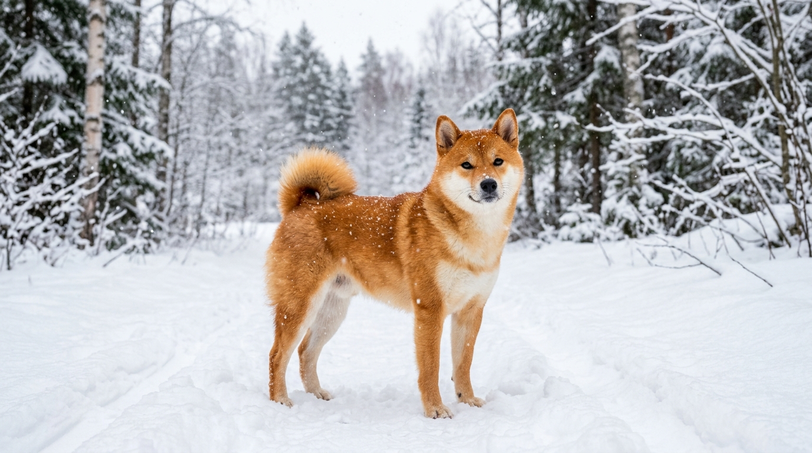
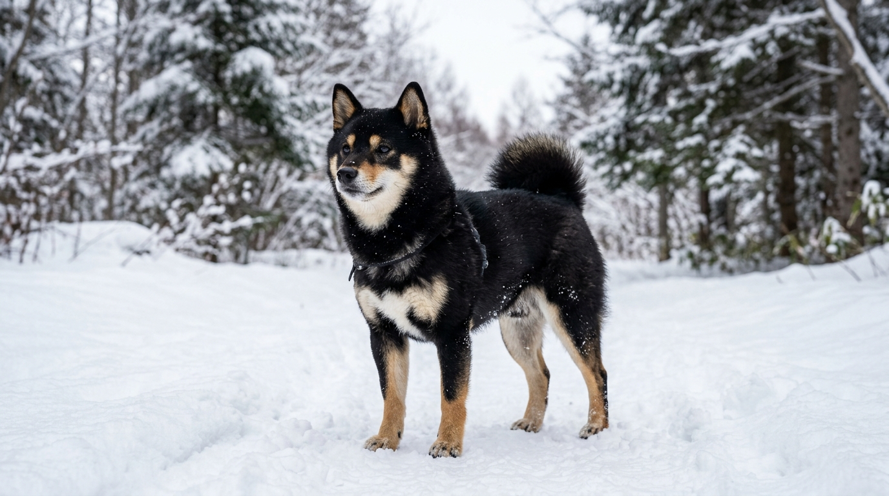
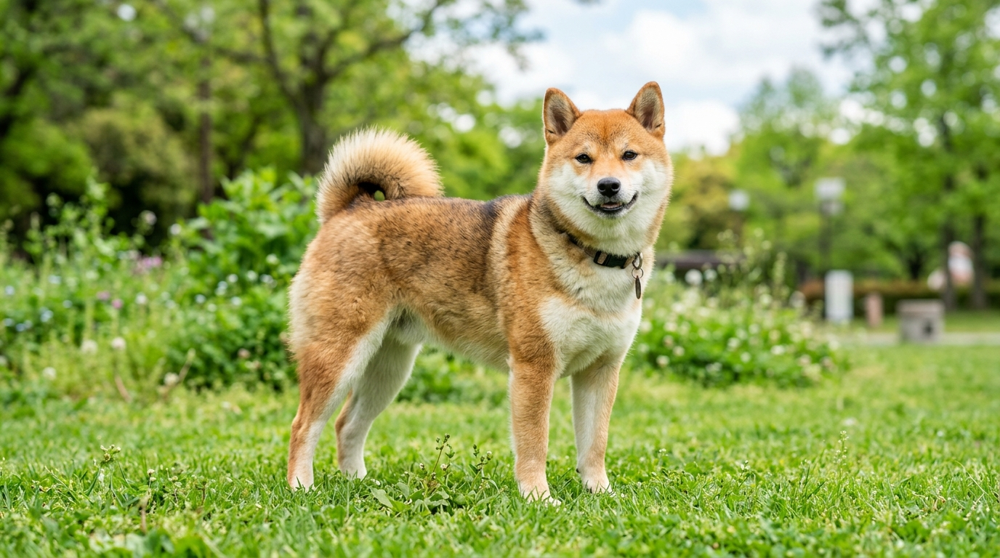
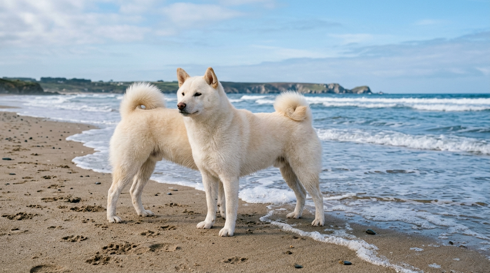

**2026년 9월 18일 기준**

## 빠른 답

**시바견 색상은 몇 가지인가요?**

공인 표준 모색은 **레드·블랙앤탄·참깨(세서미) 세 가지**다. 크림(흰색에 가까운) 시바도 실제로 존재하지만 미국 AKC 표준에서는 결점으로 처리된다. 어떤 색이든 배·가슴·뺨에 크림~흰색 털이 들어야 한다는 '우라지로' 요건이 붙는다.

## 모색 4종 도감

### 레드 — 가장 대표적인 시바색

밝은 주황~붉은 갈색 털에 우라지로가 조합된 색이다. 시바견 하면 떠오르는 그 색으로, 국내에서 만나는 시바 대부분이 레드다. 등과 머리는 진한 주황색, 턱·가슴·배·다리 안쪽은 크림색으로 나뉜다. AKC 표준은 '밝은 불꽃 같은 주황(bright orange-red)'을 이상으로 본다.

새끼 때는 몸 전체가 어두운 붉은빛인 경우가 많고, 성장하면서 밝은 레드로 바뀐다. 털갈이를 거듭하며 색이 짙어지거나 연해지기도 해서, 강아지 때의 색이 성견의 색과 똑같지는 않다.

### 블랙앤탄 — 쿠로시바, 검은 시바

일본에서 '쿠로시바(黒柴)'로 불리는 색이다. 몸은 검은 털, 눈 위·뺨·다리·가슴에 탄(황갈색) 포인트가 올라온다. 우라지로도 함께 나타나 가슴과 배가 밝다. 삼색처럼 보이기도 해서 '트라이컬러'로 오해받지만, 시바의 블랙앤탄은 포인트 자리가 정해져 있다.

레드 다음으로 흔한 색이지만 레드보다 수가 적어 국내 분양 시장에서는 레드보다 찾기가 조금 어렵다.

### 참깨 — 세서미, 가장 희귀한 표준 모색

'쿠츠오'라고도 부르는 색이다. 레드 바탕에 가드헤어(겉털) 끝부분에 검은 색이 얇게 얹힌 모색으로, 뿌려놓은 깨를 연상시켜 참깨·세서미(sesame)라는 이름이 붙었다. AKC 표준은 검은 끝단이 균일하게 분포한 상태를 이상으로 본다.

겉털 끝만 검은 것이지 줄무늬가 나는 브린들과는 다른 색이다. 세 가지 표준 모색 중 가장 드물어서, 참깨를 원하면 분양을 기다리는 경우가 많다.

### 크림 — 실존하지만 표준에서는 결점

온몸이 크림~흰색인 색이다. 일본에서 '시로시바'라 불리며 귀엽다는 인기로 국내에서도 분양이 이뤄진다. 하지만 크림색에서는 우라지로와 털 색의 대비가 보이지 않아, AKC 표준은 크림을 결점(fault)으로 처리한다. 순결을 따지는 견종계에서 '표준 모색이 아니다'라는 뜻이지, 건강에 문제가 있다는 뜻은 아니다.

애완으로 키우기엔 아무 문제없지만, dog show 출전이나 번식 기준으로는 불리한 색이다. 크림 시바를 분양받을 때는 '희귀 색'이라는 마케팅 문구만 보지 말고 [시바견 허브의 분양가대·마메시바 경고](/breeds/shiba-inu/)를 함께 확인하자.

## 우라지로 — 모든 시바에 요구되는 '배의 흰 털'

우라지로(裏白)는 배·가슴·턱·뺨에 난 크림~흰색 털을 가리키는 시바 전용 용어다. AKC 표준은 세 가지 표준 모색 모두에 우라지로를 **요구**한다. 레드에서는 목·앞가슴·가슴에, 블랙앤탄과 참깨에서는 같은 자리에 밝은 크림~흰색으로 나타난다.

이 우라지로가 있느냐 없느냐가 '시바다운 외모'를 좌우한다. 등은 진하고 배는 밝은 이 대비가 시바의 얼굴형·눈꼬리와 함께 품종 인상을 만든다. 크림이 결점 처리되는 이유도 결국 이 우라지로다 — 온몸이 크림색이면 우라지로가 어디인지 보이지 않는다.

## 모색 비교표

| 모색 | 바탕색 | 포인트 | 표준 여부 | 희귀함 |
|---|---|---|---|---|
| 레드 | 밝은 주황~붉은 갈색 | 우라지로 | 표준 | 가장 흔함 |
| 블랙앤탄 | 검은색 | 눈 위·뺌·다리·가슴에 탄 | 표준 | 레드 다음 |
| 참깨(세서미) | 레드 | 겉털 끝에 검은 끝단 | 표준 | 가장 드묾 |
| 크림 | 크림~흰색 | 없음(우라지로 안 보임) | 결점 | 색 자체는 드묾 |

참고로 모색은 성격·건강과는 관련이 없다. 성격이나 관리법이 궁금하면 [시바견 허브](/breeds/shiba-inu/)에서 성격·유전병 섹션을 보자. 색 고민보다 아토피·녹내장 같은 유전병 검사 여부를 확인하는 편이 훨씬 중요하다.

## FAQ

### 크림 시바는 건강에 문제가 있나요?

모색 자체가 건강 문제를 일으키지는 않는다. 크림이 결점 처리되는 건 우라지로 대비가 보이지 않아 견종 표준에서 벗어나기 때문이다. 다만 크림·마메시바를 '희귀·한정'으로 내세우는 분양 시장에서는 건강 검사가 소홀한 경우가 있으니, 색보다 부모견 건강검사를 먼저 따지자.

### 참깨와 브린들은 어떻게 구분하나요?

참깨는 레드 바탕의 겉털 '끝'에만 검은색이 얹힌 색이고, 브린들은 털에 줄무늬가 나는 무늬다. 멀리서 보면 비슷하지만 가까이서 털 하나를 보면 참깨는 뿌리가 밝고 끝만 검다. 시바에는 브린들이 표준 모색에 없다.

### 강아지 때 색이 성견이 되면 바뀌나요?

바뀐다. 레드 새끼는 어두운 붉은빛으로 태어나 밝은 레드로 자라며, 블랙앤탄은 강아지 때 탄 포인트가 뚜렷하다가 성장하면서 정리된다. 참깨도 털갈이를 거치며 검은 끝단의 분포가 달라진다. 최종 모색은 보통 1년 전후에 정착한다.

### 모색별로 분양가가 다른가요?

표준 모색 3색 안에서는 색을 이유로 가격이 크게 달라졌다는 공개된 기준은 없다. 분양가는 색보다 브리더의 건강검사·혈통 확인 수준에 따라 달라진다. 시바견 전체 분양가대는 [시바견 허브](/breeds/shiba-inu/)의 분양가대 섹션에 정리했다.

## 출처

- [AKC Official Standard of the Shiba Inu (PDF)](https://images.akc.org/pdf/breeds/standards/ShibaInu.pdf) (표준 모색 3종·우라지로 요건·크림 결점)
- [AKC — Shiba Inu Breed Profile](https://www.akc.org/dog-breeds/shiba-inu/) (모색 개요·red sesame 표기)
- [National Shiba Club of America — Shiba Colors](https://www.shibas.org/newstand/color.html) (AKC 표준 선호 모색 3종 확인)

*표지 이미지는 AI 생성 후 사용자 검수를 거쳤습니다.*
