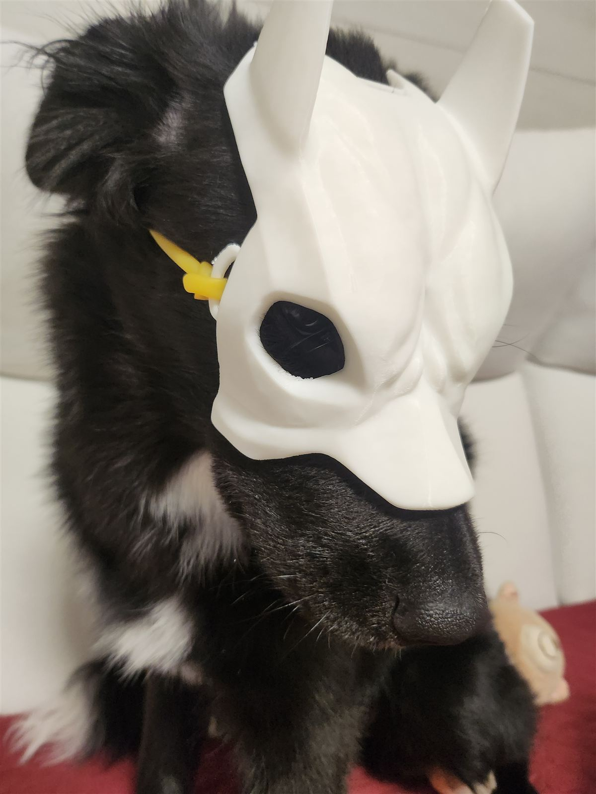
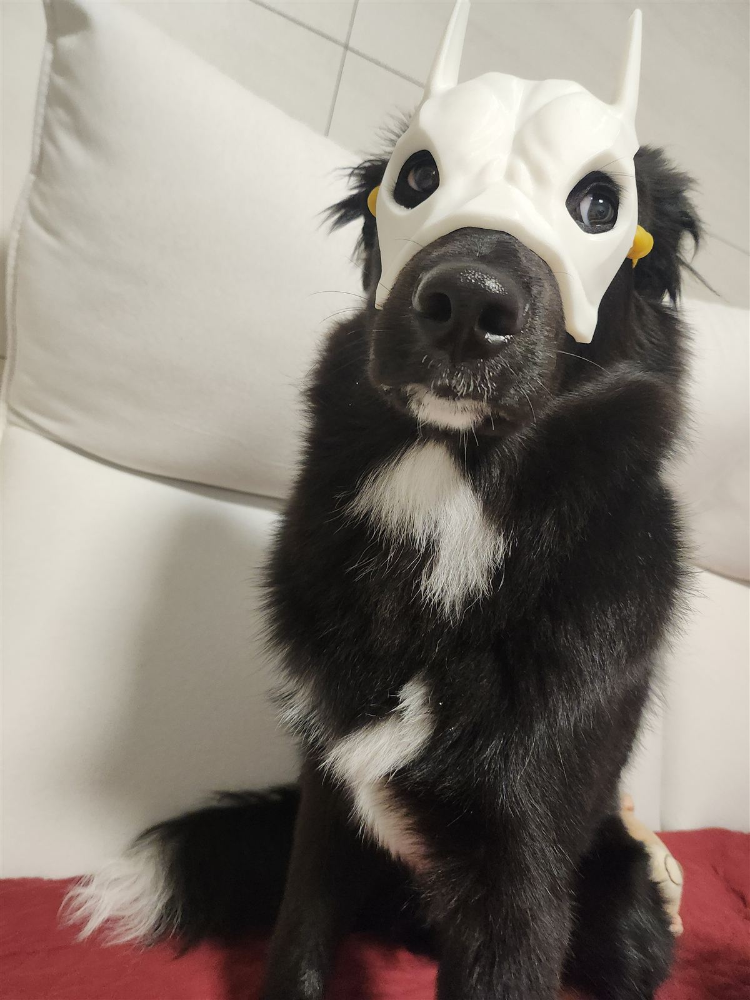
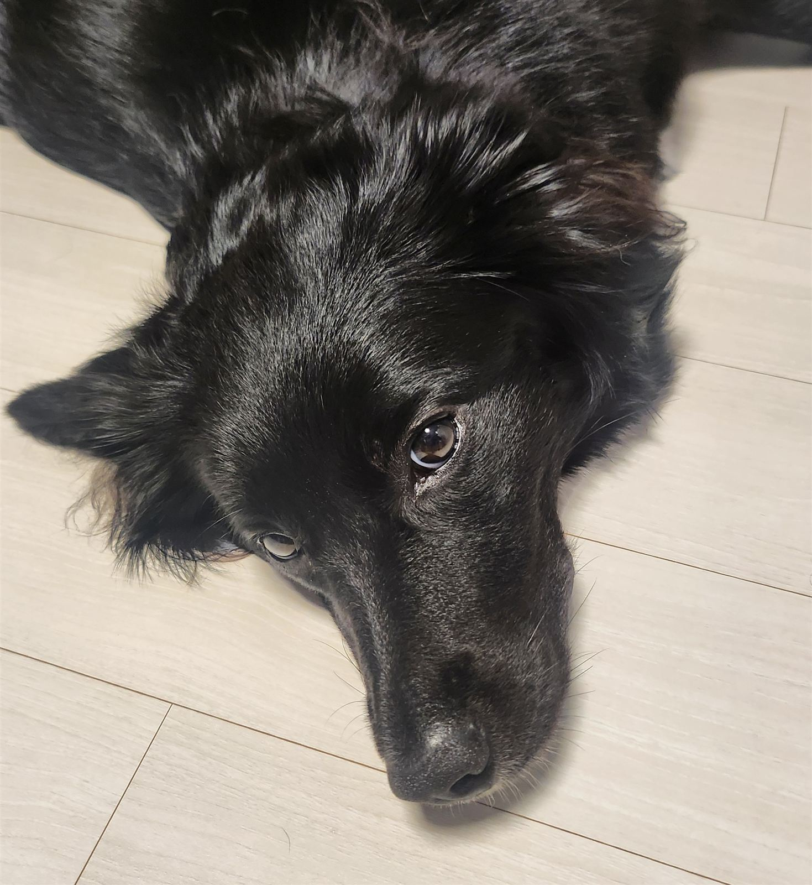

딱지를 아끼는 한 사람이 있습니다. 3D프린터를 다루는데, 어느 날 "딱지 가면 만들어 줬어" 하고 회색 가면 하나를 들고 왔습니다. 눈 구멍이 뚫리고 얼굴에 맞는 크기로 정성껏 출력한 가면이었습니다. 받는 입장에서는 감동적인 선물이죠.

문제는 이야기의 다른 주인공이 개라는 점이었습니다.

첫 반응은 거부였습니다. 가면을 얼굴에 대 주자 딱지는 고개를 비스듬히 돌리고 시선을 피했습니다. 한 손으로 쓰다듬으며 "잠깐만, 잠깐만" 하는 사진이 이 장면입니다. 웃기지만 완전히 웃을 수는 없는 표정이에요. 지금 이걸 참아 주는 이유가 뭔지, 개 입장에서는 분명히 따져 보고 있었습니다.

그래도 한 번은 씌워 봤습니다. 착용 순간 딱지는 온몸이 굳었습니다. 앉은 채로 꼼짝하지 않고, 어디로 시선을 둬야 할지 모르는 얼굴로 카메라를 봤습니다. "뻘쭘"이라는 말이 사람 얼굴에만 쓰는 줄 알았는데, 개도 뻘쭘해한다는 걸 그때 처음 알았습니다.

그리고 이 얼굴입니다. 사진을 정리하다 이 장면에 파일 이름을 붙이려다 한참을 고민했는데, 결론은 "이걸 아름답다 해야 하나"였습니다. 만들어 준 사람의 정성은 눈물 나게 감사하고, 결과물 자체는 잘 나왔습니다. 다만 모델의 표정이 그것과 무관하다는 것뿐이에요.

## 짧지만 배운 것

개는 코스프레를 이해하지 못합니다. 얼굴에 뭔가 얹히는 일이 즐거울 이유가 없는 동물이니까요. 그래서 이날 촬영은 몇 분 만에 끝냈습니다. 지킨 원칙은 세 가지였습니다.

- **강요하지 않기** — 고개를 돌리면 잠시 쉬고, 싫어하면 그 장면은 넘어갔습니다
- **짧게 끝내기** — 취향을 시험하는 시간이 아니라 기념 사진 한두 장 찍는 시간이었습니다
- **벗긴 뒤 간식과 칭찬** — 가면보다 이쪽이 기억에 남도록 마무리했습니다

가면을 만들어 준 마음은 소중하고, 쓰기를 거부한 딱지도 잘못이 없습니다. 보더콜리라서 민첩하고 똑똑할 뿐, 이런 날의 딱지는 그저 얼굴에 이상한 게 오는 걸 참아 주던 평범한 강아지였습니다. 딱지가 어떤 아이인지는 [보더콜리 품종 가이드 — 딱지 이야기](/breeds/border-collie/)에 있습니다.

가면은 지금 잘 보관 중입니다. 언젠가 딱지가 마음을 바꿀지도 모르니까요. 안 바꿀 것 같지만요.
