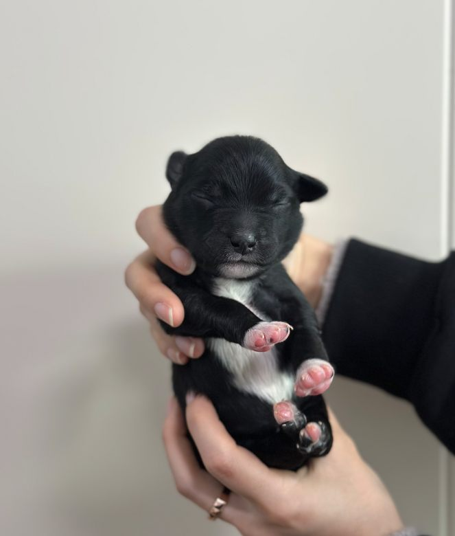
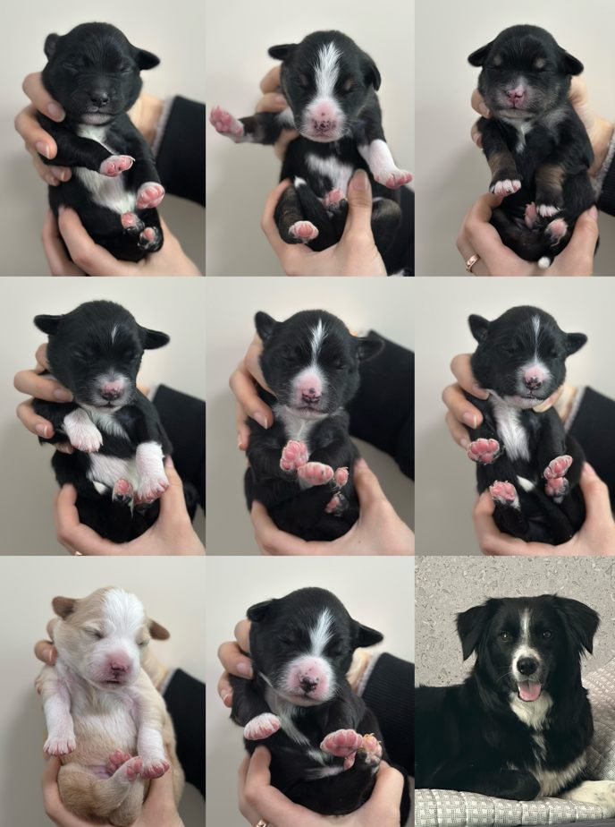
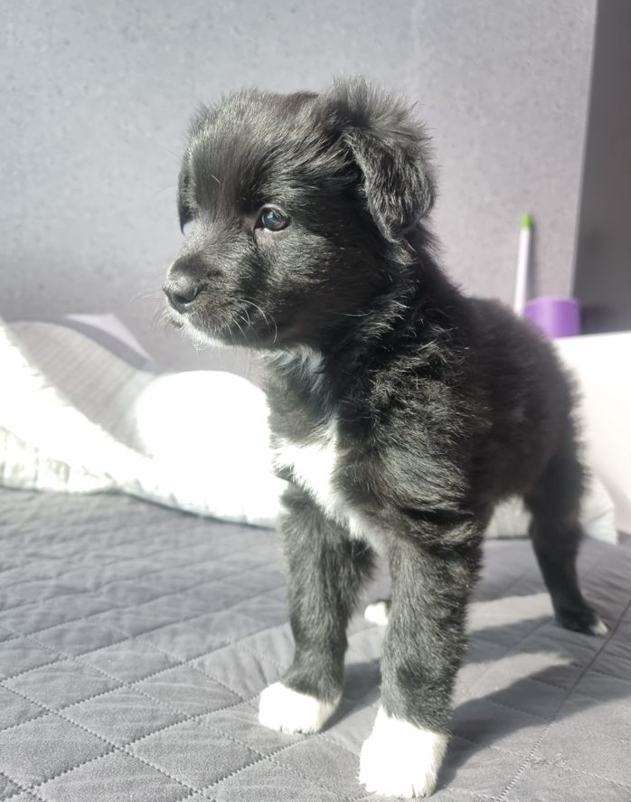
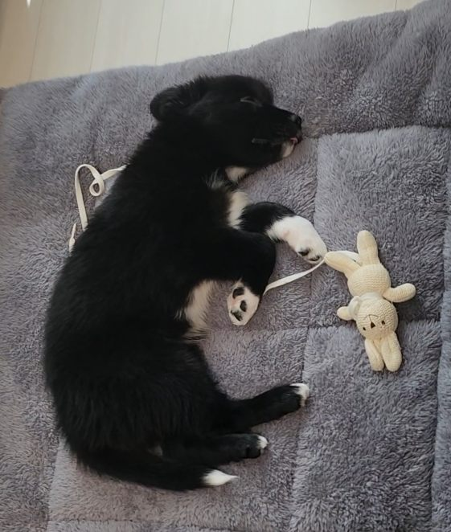
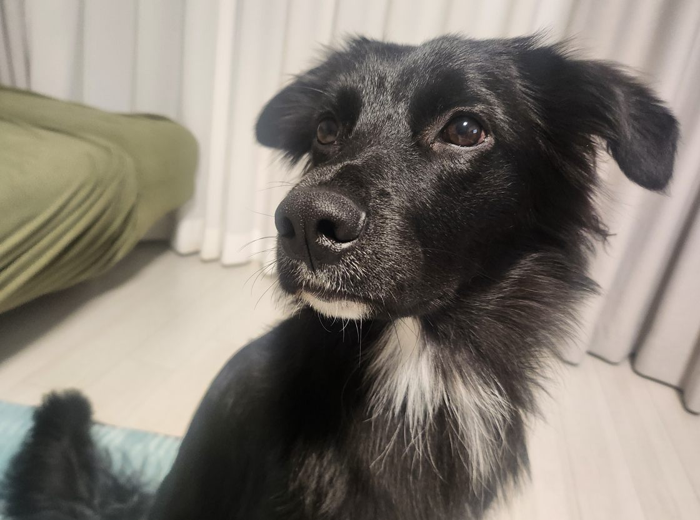
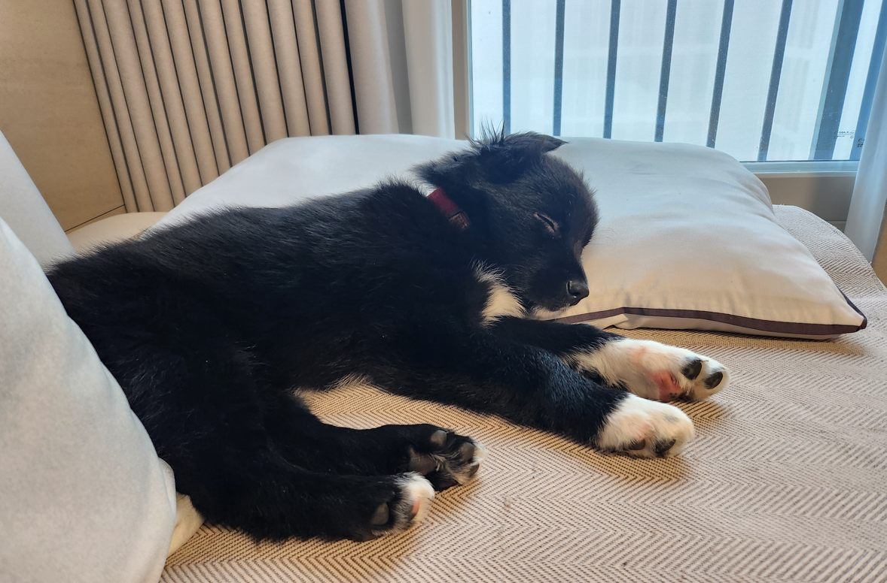
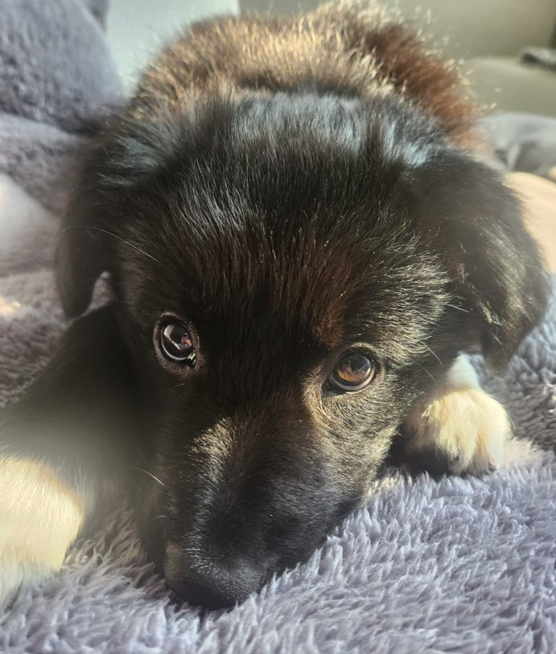
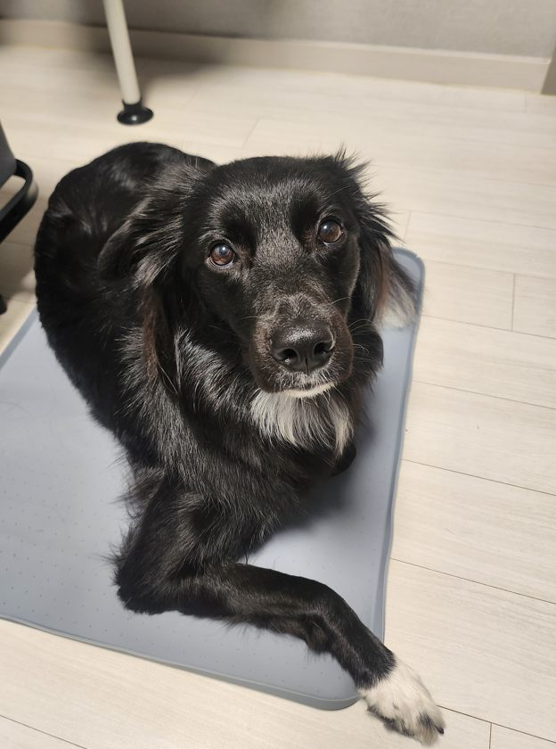

## 8남매 중 가장 먼저 세상에 나온 딱지

딱지는 2024년 12월 10일, 강원도 대관령의 어느 펜션에서 태어났다.

8남매 중 가장 먼저 세상 밖으로 나왔다고 한다. 보더콜리 특유의 블랙 앤 화이트 털을 가지고 있었지만, 얼굴만큼은 조금 달랐다. 다른 형제들에 비해 얼굴 전체가 검었고, 눈도 작았다. 어딘가 우리가 흔히 떠올리는 보더콜리의 모습과는 조금 거리가 있었다.

그런데 우리는 오히려 그런 딱지가 마음에 들었다.

결국 딱지를 우리 가족으로 맞이하기로 했다. 그렇게 딱지는 견생 두 달이 되기도 전에 우리 집에 왔다.

## 작았던 눈이 크고 예쁜 공주가 되기까지

처음 우리 집에 왔을 때의 딱지는 지금과는 사뭇 다른 모습이었다.

한 살이 될 무렵에는 털도 달라졌다. 장모라고 하기에도, 단모라고 하기에도 애매한 길이에 윤기가 흐르는 검은 털을 갖게 됐다. 어릴 때는 작아 보였던 눈도 점점 커지고 예뻐졌다.

어느새 우리 눈에는 세상에서 제일 예쁜 공주가 되어 있었다.

그리고 이제 곧 두 살이다.

시간이 참 빠르다. 처음 데려왔을 때의 모습을 생각하면 지금의 딱지가 신기하기도 하고, 앞으로는 또 어떤 모습으로 자라날지 궁금하기도 하다.

## 딱지에게도 양보하기 어려운 것이 있다

지금 딱지의 특징을 하나 꼽으라면 냄새에 대한 고집이다.

산책을 하다가 마음에 드는 냄새를 발견하면 좀처럼 헤어 나오지 못한다. 이름을 불러도 돌아보지 않고, 평소에 잘하던 콜백도 통하지 않는다. 결국 리드줄을 당겨야 그제야 냄새에서 벗어날 때가 있다.

그래서 요즘은 산책 중 냄새를 맡는 시간을 짧게 조절하고 있다.

냄새를 아예 맡지 못하게 하는 것도 아니고, 그렇다고 원하는 만큼 계속 맡게 둘 수도 없다. 딱지가 산책을 즐기면서도 보호자와 함께 걸을 수 있도록 적당한 선을 찾아가는 중이다.

함께 산다는 건 이런 작은 문제들을 하나씩 알아 가는 과정인지도 모르겠다.

냄새 산책에 대한 기본 이야기는 [강아지 산책 가이드](/guides/dog-walking/)에 정리해 두었다.

## 보더콜리는 정말 특별하게 키워야만 할까?

보더콜리를 키우기 전에도, 키우고 나서도 보더콜리에 관한 콘텐츠를 많이 접하게 된다.

보더콜리는 파양률이 높다는 이야기부터 양몰이견 특유의 운동성과 높은 에너지, 하루 종일 놀아 주지 않으면 집 안에서 사고를 친다는 이야기까지. 때로는 보더콜리를 키우는 일이 굉장히 어렵고 특별한 능력이 필요한 것처럼 느껴지기도 한다.

물론 보더콜리가 활동적이고 영리한 견종이라는 점은 잘 알고 있다. 충분한 운동과 훈련, 정신적인 자극도 필요하다.

하지만 직접 딱지를 키우고, 산책하면서 이웃의 다른 보더콜리 보호자들과 만나 이야기를 나누다 보니 이런 생각도 들었다.

그냥 보통의 보호자와 반려견처럼 함께 살아가는 것으로도 충분하지 않을까?

강아지에게 산책이 필요하고, 함께 놀아 주는 시간이 필요하다는 것은 보더콜리만의 이야기가 아니다. 어떤 견종이든 각자의 특성과 체력, 성격에 맞게 돌봐야 한다.

보더콜리라는 이유만으로 모든 개체가 똑같은 수준의 활동을 해야 하는 것도 아닐 것이다. 양몰이 역시 보더콜리의 역사와 특성을 보여 주는 능력이지만, 모든 보더콜리가 실제 양몰이를 하며 살아가는 것은 아니다.

물론 그렇다고 활동량이 많은 보더콜리의 특성을 무시해도 된다는 뜻은 아니다. 중요한 건 견종의 특성을 이해하되, 눈앞에 있는 내 강아지가 어떤 성격이고 무엇을 필요로 하는지 살피는 일이라고 생각한다.

견종에 대한 기본 정보와 한국 실정 이야기는 [보더콜리 품종 글](/breeds/border-collie/)에 정리해 두었다.

## 혹시 강아지가 힘들어하고 있는 건 아닐까?

보더콜리가 하루 종일 뛰어놀아야 한다는 콘텐츠를 보다 보면 가끔 이런 생각이 든다.

혹시 저 강아지는 정말 즐거워서 뛰는 걸까? 아니면 보호자가 좋아하니까 힘들어도 계속 뛰고 있는 건 아닐까?

물론 화면에 나온 강아지의 마음을 우리가 정확히 알 수는 없다. 충분히 즐겁게 활동하는 개체도 있을 것이고, 휴식이 더 필요한 개체도 있을 것이다.

그래서 나는 딱지를 키우면서 견종에 대한 일반적인 설명만큼이나 딱지 자신의 반응을 살피는 것이 중요하다고 느낀다.

다른 보더콜리와 비교하기보다 딱지에게 맞는 산책과 놀이를 찾아가는 것. 다른 사람이 정해 놓은 기준을 무조건 따라가기보다 우리에게 맞는 생활 방식을 만들어 가는 것.

어쩌면 그것이 반려견과 오래 함께 살아가는 데 더 중요한 일인지도 모르겠다.

## 앞으로도 딱지와 함께

딱지는 이제 곧 두 살이 된다.

냄새 앞에서는 고집도 부리고, 부르면 못 들은 척할 때도 있지만, 그런 모습까지 포함해서 딱지는 우리에게 소중한 가족이다.

아직 배워야 할 것도 많고, 함께 맞춰 가야 할 부분도 많다.

앞으로 딱지와 어떤 일상을 보내게 될지는 모르겠다. 재미있는 일이 생길 수도 있고, 지금처럼 사소한 고민을 하게 될 수도 있을 것이다.

그런 이야기들을 하나씩 이곳에 남겨 보려고 한다.

다음에는 또 어떤 재미있는 일상이 생길까?
