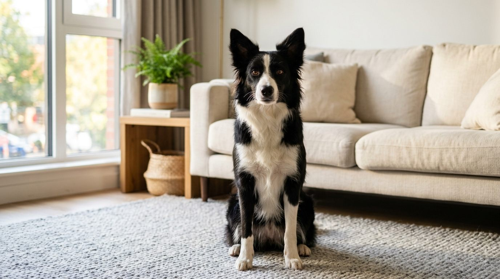

딱지는 보더콜리다. 여아. 두 살이 되어 가는 중이다. 검은 털에 흰 무늬가 들어간, 보더콜리에서 가장 흔한 모색이다. 이 사이트 이름도 이 개에서 왔다.

| | |
|---|---|
| 품종 | 보더콜리 |
| 성별 | 암컷 |
| 털 | 검은 바탕에 흰 무늬 |
| 나이 | 두 살이 되어 가는 중 |
| 사는 곳 | 아파트 |
| 형제 | 8남매 |

## 데려온 계기

거창한 이유는 없다. 혼자 산책하기가 쓸쓸해서였다. 그렇게 데려온 개가 사이트 이름이 됐다.

## 성격

기분 좋은 일이 생기면 금세 들뜬다. 진정시키는 데 공이 든다.

일은 좋아한다. 식품·생필품이 도착하면 냉장고로 옮기는 동안 옆에서 하나씩 물어다 준다. 보더콜리가 '일하고 싶어 하는 개'라는 말은 딱지를 키워보고 이해했다.

집에서의 주요 일과는 고양이 괴롭히기다. 고양이 입장에서는 반가운 일만은 아니다.

## 좋아하는 것

- **눈** — 눈만 쌓이면 좋아 죽는다. 폭설이 내리던 밤에도 통제 불능이었다.
- **원반** — 세 달 때 발밑 놀이로 시작해, 1년 뒤엔 척척 물어온다.
- **계곡 물** — 팬션 수영장에선 물을 무서워하더니, 계곡에선 첨벙였다.
- **강아지 카페** — 곤지암에서 몇 개월 위 보더콜리 베스를 만나 놀았다.

## 딱지가 나온 글

- [3D프린터로 만든 가면](/daily/ddakji-3d-printed-mask/)
- [강아지 카페에서 만난 베스](/daily/ddakji-dog-cafe-friend/)
- [눈 쌓인 언덕 달리기](/daily/ddakji-snow-run/)
- [폭설이 쏟아지던 밤](/daily/ddakji-snowstorm-night/)
- [계곡에서 첨벙인 날](/daily/ddakji-valley-swim/)
- [첫 생일, 8남매 펜션 여행](/daily/ddakji-first-birthday/)
- [원반 물어오기](/daily/ddakji-frisbee-fetch/)
- [원반 던지기](/daily/ddakji-frisbee-throwing/)

품종 정보가 필요하면 [보더콜리 허브](/breeds/border-collie/)에 정리돼 있다.

---

표지 이미지는 AI로 생성한 실사 스타일 이미지다.
