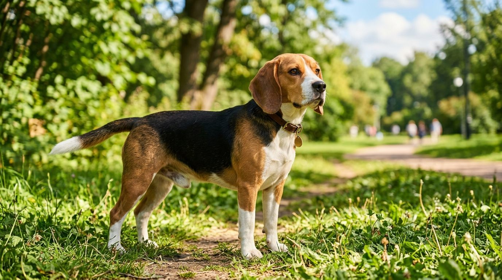
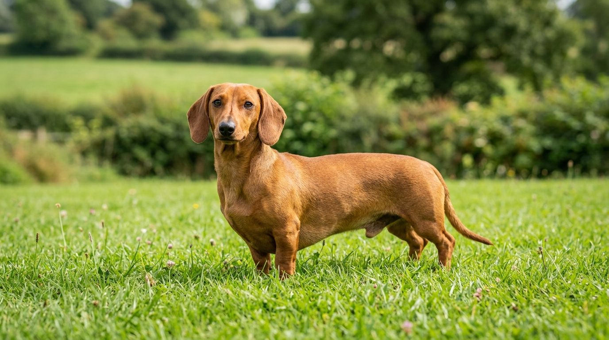
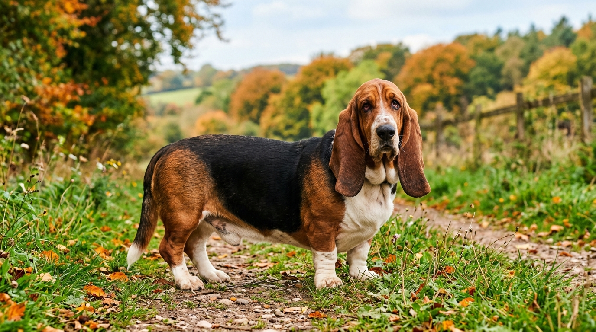
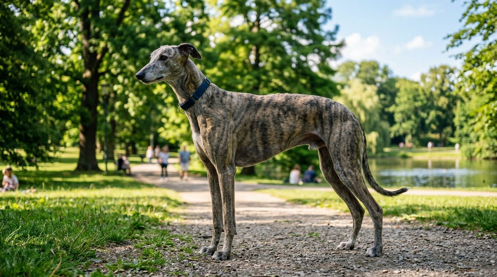
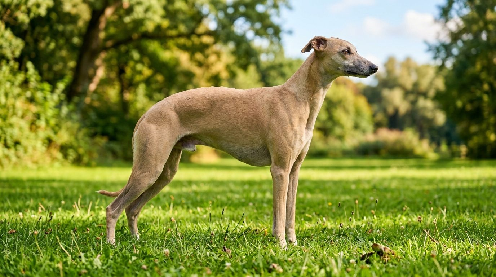
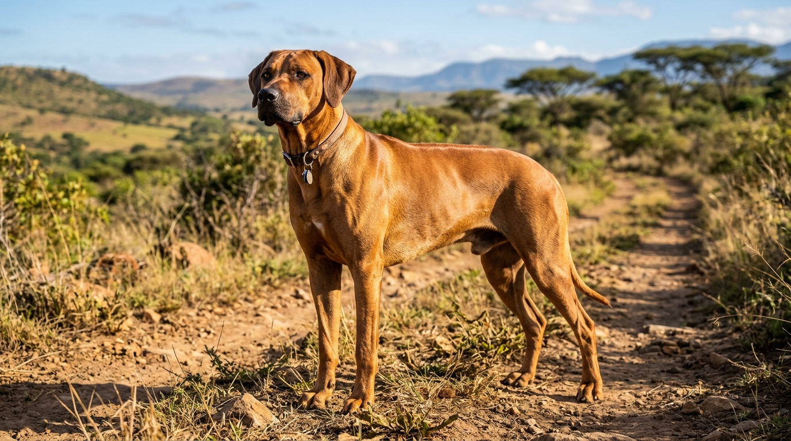

**2026년 9월 15일 기준**

사냥개 하운드. 겉모습은 제각각이라 하나로 묶기 어렵다. 다리가 짧고 처진 귀의 바셋 하운드부터 시속 70km로 내달리는 그레이하운드까지, AKC 하운드 그룹에는 30여 종이 넘게 속한다. 이 글에서는 한국에서 마주칠 확률이 높은 6종만 골라 크기·성격·운동량·건강 문제로 비교한다.

## 빠른 답

**하운드는 어떤 견종인가요?**

전부 사냥개 후손이고, 사냥 방식에 따라 둘로 나뉜다. 코로 쫓는 **후각하운드**(비글·닥스훈트·바셋)와 눈으로 쫓아 달리는 **시각하운드**(그레이하운드·휘핏 등). 공통점은 강한 사냥 본능과 목줄의 필요다. 실내 키우기는 휘핏·비글·닥스훈트가 무난하고, 그레이하운드·릿지백은 운동 여건이 뒷받침될 때다.

## 하운드 그룹 — 사냥 방식으로 나누는 두 계열

AKC는 하운드 그룹을 "사냥에 쓰였다는 공통 조상"으로 묶으면서도 "일반화하기 어려울 만큼 다양하다"고 설명한다. 나누는 축은 사냥 방식이다.

- **후각하운드(scent hound)** — 날카로운 후각으로 냄새 자취를 따라간다. 비글, 블러드하운드, 바셋 하운드, 닥스훈트가 여기 속한다. 사냥 개체들끼리 소통하느라 크고 길게 우는 **바잉(baying)** 습성이 남아 있다. AKC는 입양 전에 이 소리를 미리 들어보라고 권한다.
- **시각하운드(sighthound)** — 눈으로 먹잇감을 찾아 순간적으로 내달린다. 그레이하운드, 휘핏, 아프간 하운드, 살루키가 여기 속한다. 폭발적인 스프린트에 지구력까지 갖췄다.

두 계열 모두 사냥 본능(prey drive)이 강해, 산책 때 목줄은 기본이고 자유 활동은 담장 안에서만 해야 한다.

## 후각하운드 3종

### 비글 — 다루기 쉬운 입문 하운드

토끼 사냥을 위해 무리로 사냥하도록 만들어진 견종이라 회사를 좋아하고 대체로 온화하다(AKC). PetMD는 "쾌활하고 유쾌하다"는 표현을 쓴다.

| 항목 | 수치 |
|---|---|
| 체고 | 30.5~38cm(13~15인치형), 30.5cm 미만(미니형) |
| 체중 | 약 13.6kg 이하 |
| 수명 | 10~15년 |
| 운동 | 하루 최소 1시간 |

- **후각이 문제다.** 냄새를 쫓아 이탈하기 쉬워 실외에서는 목줄이 필수다. 쓰레기통·가방 뒤지기도 후각에서 나온다.
- **짖음·하울링**이 크고 길다. 견종명도 '벌어진 목구멍'을 뜻하는 프랑스어에서 왔다는 설이 있을 정도다.
- 처진 귀라 **귀 감염**이 잦다. 월 1~2회 귀 청소가 기본이다. 식욕이 왕성해 비만도 흔하다.

### 닥스훈트 — 굴속 오소리 사냥개

길고 낮은 체형은 굴속 오소리 사냥에서 왔다. 스탠다드(7.3~14.5kg)와 미니어처(약 5kg 미만) 두 크기에, 평모·장모·와이어헤어 세 코트가 있다(AKC·PetMD). 수명은 12~16년으로 긴 편이다.

- **최대 리스크는 척추다.** 추간판 질환(IVDD)은 최대 25%가 평생 발병한다(PetMD). 점프·계단 오르내리기를 줄이고, 근육을 위해 매일 산책은 꾸준히 한다.
- 소형견이지만 두뇌 자극이 필요하다. 파기·후각 사냥 본능이 남아 퍼즐 장난감이 잘 맞는다.
- 고집이 세 훈련이 밀리기 쉽고, 짖음 습관도 관리 대상이다.

### 바셋 하운드 — 느긋한 저에너지 하운드

'바셋'은 프랑스어로 '낮다'는 뜻이다. 체고 38cm 이하에 체중 18~29kg, 수명 12~13년(PetMD). 하운드 중에서는 드물게 저에너지 성격이라 매일 산책 한 번이면 기본은 충족된다.

- 후각은 비글급으로 예리하다. 떨어진 음식을 잘 찾아내고 잘못 삼키기도 해 사료 보관은 밀봉이 기본이다.
- 처진 귀·주름진 피부라 **귀 청소 주 1~2회**와 피부 관리가 필요하다.
- 긴 등·짧은 다리 구조로 IVDD 위험이 있고, 깊은 가슴 때문에 **위염전(GDV)**도 경계 대상이다.
- 사냥개 특유의 크고 긴 울음(바잉)은 각오해야 한다.

## 시각하운드 3종

### 그레이하운드 — 세계에서 가장 빠른 개

개 세계의 최고 단거리 스프린터(AKC). 체고 69~76cm, 체중 27~32kg의 대형견이지만 수명은 10~14년으로 긴 편이다.

- **집에서는 '소파 감성'이다.** 운동만 시키면 하루 종일 쉬는 걸 좋아한다(PetMD). '은퇴한 경주견'이라는 이미지와 달리 키워보면 뜻밖에 조용하다.
- 짧은 시간 질주할 기회와 목줄 산책이면 충분하다. 대신 사냥 본능이 강해 고양이 등 소형동물과는 합을 보아야 한다.
- 깊은 가슴으로 **위염전(GDV)** 위험이 있고, **마취에 민감**해 수술 시 수의사에게 미리 알려야 한다.

### 휘핏 — 그레이하운드의 소형판

그레이하운드와 작은 테리어 교배로 만들어진 견종이다. 체고 46~56cm, 체중 11~18kg, 수명 12~15년. 최고 시속 약 56km(PetMD).

- 짖음이 적고 집에서 조용해 **실내 키우기 적합성이 높은** 하운드다. 대신 민감한 성격이라 조용한 가정이 잘 맞는다.
- 매일 산책에 짧은 스프린트 기회만 있으면 된다. 작은 동물을 쫓는 본능은 그대로 있어 목줄·높은 울타리가 필수다.
- 털·피부가 얇아 추위에 약하다. 겨울엔 옷을 입히고, 다리 상처가 나기 쉬운 것도 감안한다.

### 로디지안 릿지백 — 사자 사냥의 역사

아프리카에서 사자를 몰던 견종이다. 체고 61~69cm, 체중 32~39kg, 수명 10~12년. 등 중앙의 털이 반대 방향으로 자라는 **능선(ridge)**이 표준이다. 모색은 휘튼(밀색~붉은기) 한 가지뿐이다.

- 하루 최소 45분 운동에 매일 두뇌 자극이 필요하다. 지루하면 파괴 행동으로 나온다(PetMD).
- 가족에게 애정이 깊지만 낯선 사람에게 거리를 두고, 독립적이라 평생 훈련이 이어진다. 하운드 입문견으로는 권하기 어렵다.
- 유의할 유전 문제: 고관절·팔꿈치 이형성증, 피부 누공(dermoid sinus), 생후 6개월경부터 시작하는 진행성 난청.

## 6종 비교표

| 견종 | 계열 | 체고 | 체중 | 수명 | 운동 | 실내 키우기 | 대표 건강 리스크 |
|---|---|---|---|---|---|---|---|
| 비글 | 후각 | 30~38cm | ~13.6kg | 10~15년 | 하루 1시간+ | 가능 | 귀 감염·비만·간질 |
| 닥스훈트 | 후각 | 13~23cm | 5~14.5kg | 12~16년 | 매일 산책+두뇌 | 가능 | IVDD(최대 25%) |
| 바셋 하운드 | 후각 | ~38cm | 18~29kg | 12~13년 | 하루 1회 산책 | 가능 | 귀 감염·IVDD·위염전 |
| 그레이하운드 | 시각 | 69~76cm | 27~32kg | 10~14년 | 스프린트+산책 | 의외로 가능 | 위염전·마취 민감 |
| 휘핏 | 시각 | 46~56cm | 11~18kg | 12~15년 | 산책+스프린트 | 잘 맞음 | 심장(승모판)·얇은 피부 |
| 로디지안 릿지백 | 시각 | 61~69cm | 32~39kg | 10~12년 | 45분+두뇌 | 여건 필요 | 관절 이형성증·피부 누공 |

## 하운드를 키울 때 공통으로 챙길 것

1. **목줄은 협상 없다.** 후각이든 시각이든 쫓기 시작하면 부르는 소리가 안 들린다.
2. **울음 소리를 먼저 듣고 결정한다.** 바잉은 훈련으로 줄일 수는 있어도 없애지는 못한다. 아파트라면 층간소음을 먼저 따진다.
3. **귀·척추·위**가 하운드 3대 관리 지점이다. 처진 귀는 청소, 긴 등은 점프 제한, 깊은 가슴은 식사 분할.
4. 사료는 후각하운드의 폭식·비만을 막는 정량 급여가 원칙이다. 봉투 고르는 기준은 [강아지 사료 고르기 가이드](/guides/choosing-dog-food/)에 정리했다.
5. 대형 시각하운드 2종(그레이하운드·릿지백)은 성장기 관리가 특히 중요하다. 나이별 운동 기준은 [골든 리트리버 운동량 글](/breeds/golden-retriever-exercise/)의 성장판 섹션을 참고한다.

retriever 계열과 비교해 보고 싶다면 [리트리버 종류 도감](/guides/retriever-types/)을 함께 본다.

## FAQ

**하운드는 아파트에서 못 키우나요?**

키울 수 없다는 건 아니다. 휘핏·비글·닥스훈트는 실내 생활 적응이 잘 되는 편이고, 그레이하운드도 뜻밖에 실내에서 조용하다. 다만 울음이 큰 비글·바셋은 층간소음, 대형 2종은 운동 여건을 먼저 따져야 한다.

**하운드는 왜 그렇게 잘 달아나나요?**

사냥개로 개량된 결과다. 후각하운드는 냄새 자취를, 시각하운드는 움직이는 물체를 쫓는 본능이 남아 있어, 쫓기 시작하면 부름에 반응하지 않는다. 목줄·담장은 이 하운드 계열 특성에 대한 기본 안전장치다.

**그레이하운드는 은퇴 경주견 입양이 좋은 선택인가요?**

성견 입양이라 강아지 시절 육아가 없다는 장점과, 경주장 생활 이력에 따른 적응 기간이 필요하다는 점을 함께 놓고 판단한다. 국내 입양 경로와 개체 상태는 개별 확인이 필수다.

**비글과 닥스훈트 중 처음 키우기 쉬운 쪽은요?**

둘 다 '첫 반려견 가능' 평가를 받는다(PetMD). 비글은 사교적이지만 운동량·울음이, 닥스훈트는 조용하지만 척추 관리와 고집이 과제다. 집이 아파트라면 울음이 적은 닥스훈트 쪽이 무난하다.

**시각하운드는 마취 위험이 진짜로 있나요?**

그레이하운드는 체내 효소 특성으로 마취 회복이 늦어질 수 있다는 것이 수의학적으로 알려져 있다(PetMD). 수술·마취 전에 견종을 반드시 알리면 용량·약제를 조정할 수 있다.

## 출처

- [AKC — Hound Group](https://www.akc.org/dog-breeds/hound/) (하운드 그룹의 사냥 유래, 후각·시각 하운드 구분, 바잉 권고)
- [AKC — Beagle](https://www.akc.org/dog-breeds/beagle/) (무리 사냥 유래·온화한 성격)
- [AKC — Dachshund](https://www.akc.org/dog-breeds/dachshund/) (두 크기·세 코트)
- [AKC — Greyhound](https://www.akc.org/dog-breeds/greyhound/) (최고 스프린터·성격)
- [PetMD — Beagle](https://www.petmd.com/dog/breeds/beagle) (체고·체중·수명·운동 1시간·건강 문제)
- [PetMD — Dachshund](https://www.petmd.com/dog/breeds/dachshund) (크기별 수치·IVDD 25%·운동)
- [PetMD — Basset Hound](https://www.petmd.com/dog/breeds/basset-hound) (체고·체중·수명·귀 청소 주기·GDV)
- [PetMD — Greyhound](https://www.petmd.com/dog/breeds/greyhound) (체고·체중·소파 감성·GDV·마취 민감성)
- [PetMD — Whippet](https://www.petmd.com/dog/breeds/whippet) (체고·체중·수명·시속 56km·건강 문제)
- [PetMD — Rhodesian Ridgeback](https://www.petmd.com/dog/breeds/rhodesian-ridgeback) (체고·체중·수명·능선·피부 누공·난청)
- [Daily Paws — Greyhound](https://www.dailypaws.com/dogs-puppies/dog-breeds/greyhound) (수명 10~14년)

*표지·본문 견종별 이미지는 AI로 생성한 실사 스타일 일러스트입니다.*
