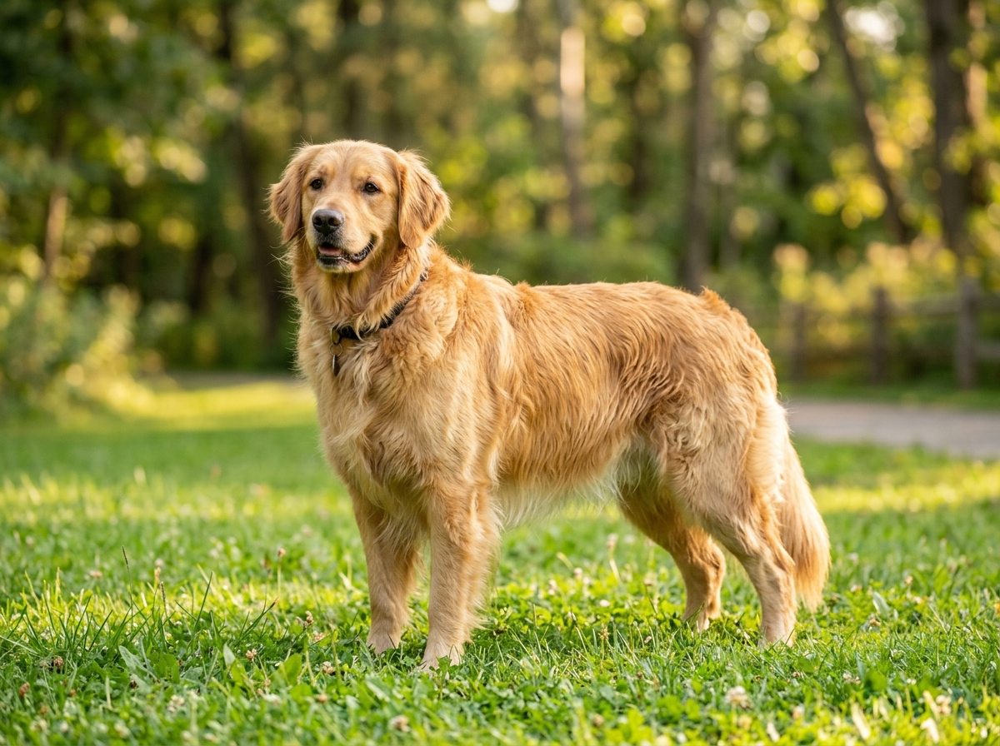
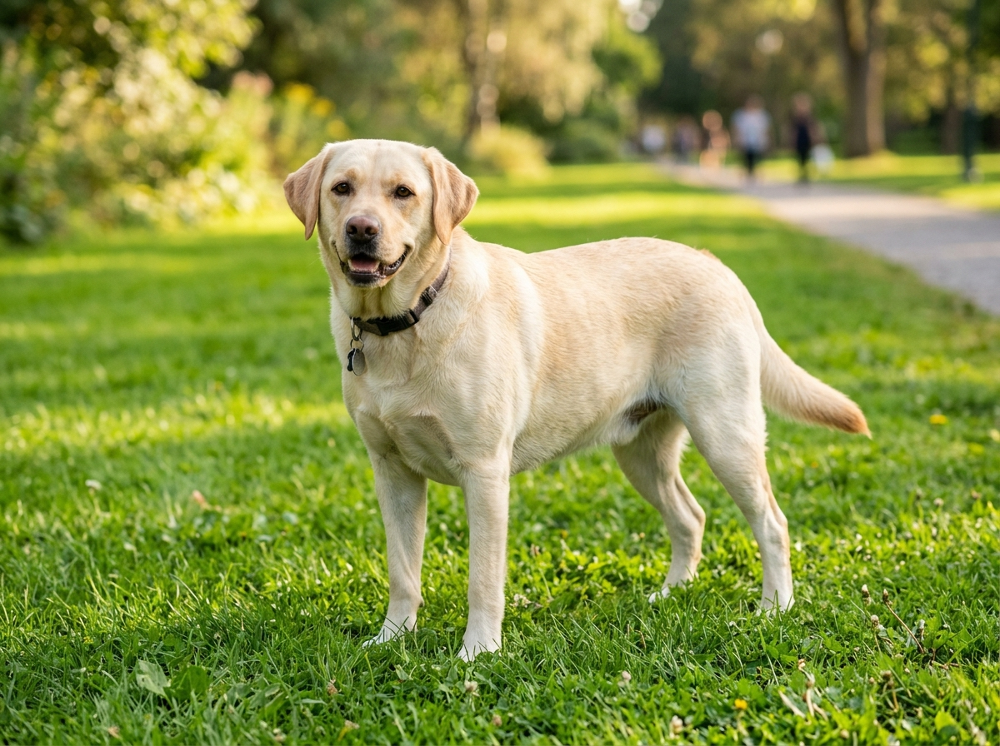
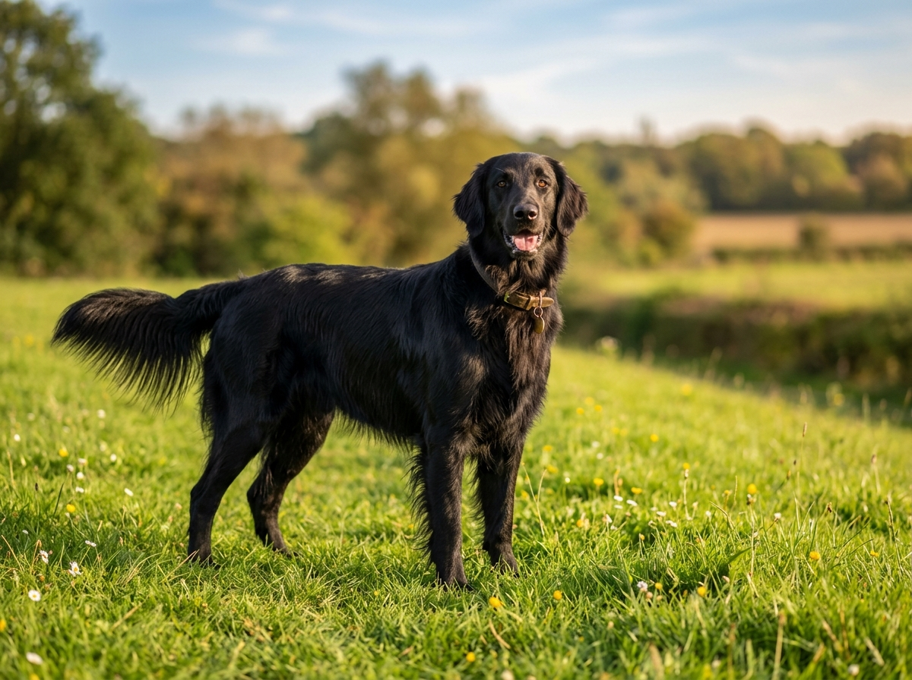
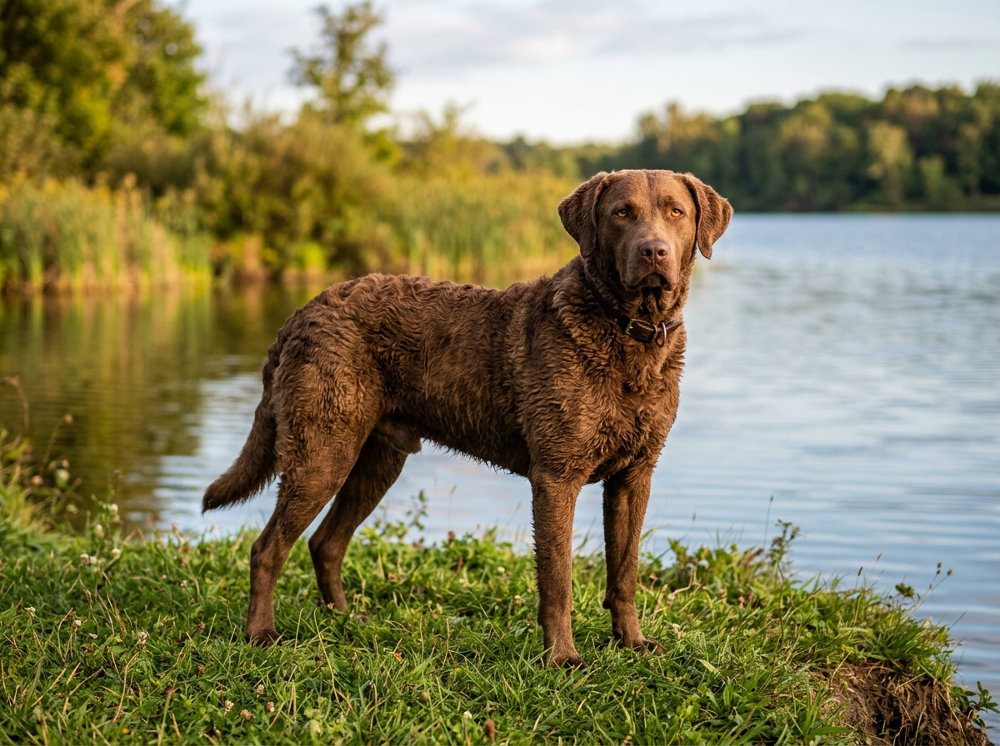
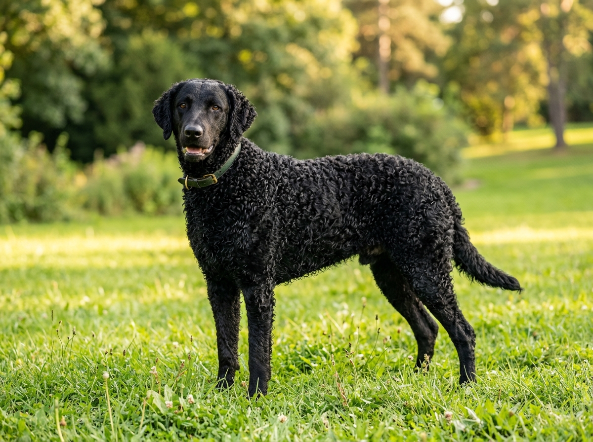
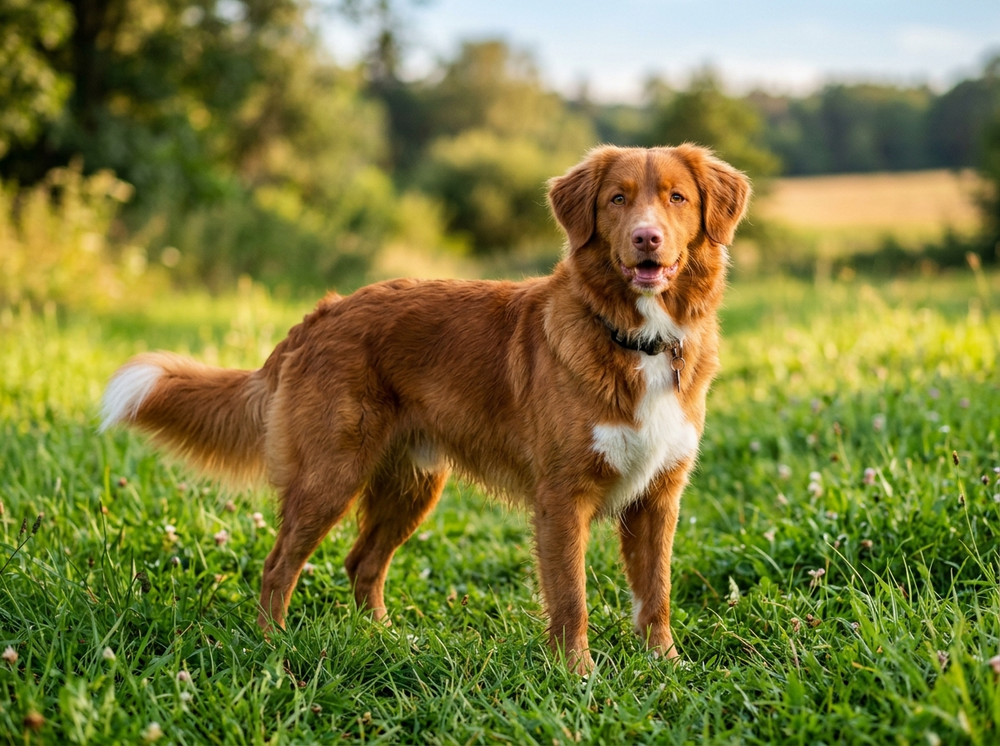

**2026년 9월 14일 기준**

리트리버 하면 골든 리트리버와 래브라도 리트리버가 떠오르지만, 리트리버로 분류되는 견종은 여섯 가지다. '리트리버(retriever)'는 영어로 '물어 오는 개'라는 뜻이다. 사냥에서 떨어진 물새를 물어 오도록 개량된 견종 무리에 붙은 이름이다. 미국 켄넬클럽(AKC)의 스포팅 그룹에는 골든·래브라도 리트리버와 함께 플랫코티드, 체서피크 베이, 컬리코티드, 노바스코샤 덕 톨링 리트리버가 속한다.

한국에서 흔히 만나는 건 골든과 래브라도 두 종이다. 나머지 네 종은 국내 분양 물량이 드물어 길에서 만날 일이 거의 없다. 전 세계 안내견의 90% 이상이 리트리버라는 사실도 이 두 종이 쌓은 평판 덕분이다.

이 글에서는 리트리버 6종을 털·체구·성격·운동량 기준으로 비교하고, 가장 많이 묻는 골든과 래브라도의 차이를 짚는다. 수치는 AKC와 수의학 미디어 PetMD의 견종 정보를 따랐다.

## 빠른 답

- **리트리버는 몇 종류인가요?** — AKC 스포팅 그룹 기준 여섯 종입니다. 골든 리트리버, 래브라도 리트리버, 플랫코티드 리트리버, 체서피크 베이 리트리버, 컬리코티드 리트리버, 노바스코샤 덕 톨링 리트리버가 여기에 속합니다.
- **골든 리트리버와 래브라도 리트리버는 무엇이 다른가요?** — 털이 가장 뚜렷한 차이입니다. 골든은 길고 윤기 나는 털, 래브라도는 짧고 조밀한 털을 가집니다. 체구는 비슷하지만 래브라도 쪽이 에너지가 조금 더 높습니다.
- **검은색 골든 리트리버가 있나요?** — 없습니다. 검은색 대형견은 대부분 플랫코티드 리트리버나 골든 잡종입니다. 골든의 표준 색상은 [골든 리트리버 허브 글](/breeds/golden-retriever/)에서 다룹니다.
- **리트리버는 다 물어 오기를 잘하나요?** — 회수 본능은 여섯 종 모두에 있습니다. 다만 '던지면 알아서 물어 온다'는 건 훈련으로 다듬어야 합니다. 단계별 훈련법은 [강아지 공놀이 글](/guides/dog-ball-play/)에 정리했습니다.
- **한국에서 가장 흔한 리트리버는?** — 골든과 래브라도입니다. 나머지 네 종은 분양 물량이 드물어 가격·건강 정보도 부족한 편입니다.

## 리트리버 6종 한눈에 보기

| 종류 | 원산지 | 체구 | 털 | 수명 | 한국 희귀도 |
|---|---|---|---|---|---|
| 골든 리트리버 | 스코틀랜드 | 키 53~61cm · 25~34kg | 길고 윤기 나는 이중모, 골드 계열 | 10~12년 | 흔함 |
| 래브라도 리트리버 | 캐나다 | 키 53~64cm · 25~36kg | 짧고 조밀한 이중모, 블랙·옐로·초콜릿 | 11~13년 | 흔함 |
| 플랫코티드 리트리버 | 영국 | 키 56~62cm · 27~32kg | 광택 나는 직모, 검정·브라운 | 8~10년 | 드묾 |
| 체서피크 베이 리트리버 | 미국 | 키 53~66cm · 25~36kg | 물결 모양 방수 이중모, 갈색 계열 | 약 10년 | 드묾 |
| 컬리코티드 리트리버 | 영국 | 키 58~69cm · 27~43kg | 촘촘한 곱슬 단일모, 검정·리버 | 10~12년 | 드묾 |
| 노바스코샤 덕 톨링 리트리버 | 캐나다 | 키 43~53cm · 16~23kg | 붉은 이중모, 꼬리 끝 흰 무늬 | 12~14년 | 드묾 |

수치는 PetMD 견종 정보 기준이다. 견종 표준에 따라 개체 차이가 있으며, 체서피크 베이의 수명은 뒤에서 따로 설명한다.

## 골든 리트리버 vs 래브라도 리트리버 — 가장 많이 묻는 비교

두 견종은 체구와 성격이 비슷해서 언뜻 구분이 어렵다. 가장 확실한 구분점은 털이다.

| 비교 항목 | 골든 리트리버 | 래브라도 리트리버 |
|---|---|---|
| 털 | 길고 윤기 나는 이중모, 골드 계열 | 짧고 조밀한 이중모, 블랙·옐로·초콜릿 3색 |
| 체구 | 키 53~61cm, 25~34kg | 키 53~64cm, 25~36kg |
| 수명 | 10~12년 | 11~13년 |
| 성격 | 온화하고 조용한 편, 낯선 사람에게도 친화적 | 외향적이고 에너지가 높음 |
| 털 관리 | 긴 털이라 빗질·목욕에 손이 더 감 | 짧은 털이라 관리 수월 |

털에 관한 오해가 하나 있다. 래브라도는 털이 짧아서 골든보다 덜 빠진다고 생각하기 쉬운데, 둘 다 물을 튕기는 이중모라 털빠짐은 비슷하게 많다. PetMD는 래브라도에 주 2~3회 빗질을 권장한다. 골든도 같은 수준으로 빗겨 줘야 한다.

성격 쪽은 골든이 조용한 편이다. PetMD는 골든을 짖음이 적은 견종으로 소개하고, 래브라도는 낯선 사람에게도 애정 표현이 많고 매일 최소 1시간의 운동이 필요한 견종으로 설명한다. 두 종 모두 대형견 유지비와 털 관리를 감당할 수 있어야 한다는 점은 같다.

안내견 업계에서도 두 종의 차이가 그대로 나타난다. 전 세계 안내견의 90% 이상이 리트리버인데, 국내에서 안내견을 양성하는 삼성화재 안내견학교도 골든과 래브라도 두 종을 쓴다. 털 관리가 수월한 래브라도 쪽이 최근에는 더 선호된다고 한다.

## 나머지 4종 — 한국에서는 길에서 만나기 어려운 리트리버들

### 플랫코티드 리트리버 — '검은 골든'으로 오해받는 견종

영국 원산이다. 검정 또는 브라운의 광택 나는 직모를 가진다. AKC가 '스포팅 그룹의 피터팬'이라 부를 만큼 성견이 되어도 강아지 같은 성격을 유지하는 견종이다. 수명은 8~10년으로 리트리버 6종 가운데 가장 짧다.

인터넷에서 '검은 골든 리트리버'라고 떠도는 사진의 상당수가 이 견종이다. 골든 리트리버의 표준 모색에 검은색은 없다.

### 체서피크 베이 리트리버 — 미국 원산, 수영에 최적화된 견종

리트리버 6종 가운데 유일한 미국 원산이다. 메릴랜드주의 체서피크 만에서 차가운 물에 뛰어들어 오리를 물어 오도록 개량되었다. 털은 물결 모양의 양털 같은 방수 이중모다. PetMD에 따르면 털의 천연 유분이 방수 기능을 유지하는 데 중요해서 잦은 목욕은 오히려 피하고, 두 달에 한 번 정도면 충분하다.

성격은 리트리버 중 가장 독립적이다. 충성스럽고 애정이 많지만 자기 판단이 강해 처음 키우는 사람에게는 부담이 될 수 있다. 수명은 약 10년으로 짧은 편인데, 영국 켄넬클럽 조사에서는 중앙값 10.75년, 미국 브리드 클럽 조사에서는 평균 9.4년으로 집계되었다.

### 컬리코티드 리트리버 — 가장 오래된 리트리버, 곱슬 단일모

리트리버 중 가장 오래된 축에 속하는 영국 원산 견종이다. 작고 촘촘한 곱슬털이 온몸을 덮고 색은 검정과 리버 두 가지다. 속털이 없는 단일모라 털은 봄·가을 털갈이 시기에만 많이 빠진다. 브러싱은 오히려 컬을 부술 수 있어 권장되지 않으니, 리트리버 중에서는 털 관리가 가장 쉬운 편이다.

체구는 키 58~69cm·27~43kg으로 리트리버 중 가장 크고, 운동 요구량도 하루 약 2시간으로 최상위다. 가족에게는 애정이 깊지만 낯선 사람에게 거리를 두는 성향이 있어 어릴 때 사회화가 중요하다.

### 노바스코샤 덕 톨링 리트리버 — 가장 작고, 특이한 사냥법의 소유자

캐나다 노바스코샤주 원산이다. 키 43~53cm·16~23kg으로 리트리버 6종 가운데 가장 작아 중형견 크기다. 붉은 털과 꼬리 끝의 흰 무늬가 특징이다.

'톨링(tolling)'은 물가에서 뛰놀며 오리를 사냥꾼의 사거리 안으로 유인하는 사냥법이다. 개가 뛰노는 모습에 호기심을 느낀 오리가 가까이 헤엄쳐 오면 사냥꾼이 쏘고, 개가 떨어진 새를 물어 온다. 이 견종의 붉은 털과 흰 꼬리 무늬가 유인 역할을 한다. 수명은 12~14년으로 리트리버 중 가장 긴 편이다.

에너지와 지능이 모두 높고, 흥분하면 특유의 고음 소리를 낸다. 초보 견주보다는 활동적인 가정에 맞는다.

## 한국에서 리트리버를 만나는 현실

골든 리트리버는 국내 대형견 분양 시장의 대표 견종이다. 시세표(가정분양 30만~75만 원대 등)는 [골든 리트리버 허브 글](/breeds/golden-retriever/)에 정리해 두었다. 래브라도도 가정분양 카페를 중심으로 매물이 꾸준히 올라온다.

희귀 4종은 다르다. 플랫코티드, 체서피크 베이, 컬리코티드, 톨러는 국내 분양 물량 자체가 드물다. 해외 브리더로부터 입양하거나 국내 번식가를 찾아야 하는데, 물량이 적다 보니 가격과 건강 이력 정보도 부족한 편이다. 입양 전에 브리더의 이력과 부모견의 유전병 검사 기록을 확인하는 것이 더 중요하다.

골든·래브라도에는 또 하나의 입양 경로가 있다. 삼성화재 안내견학교는 훈련에서 탈락한 개를 일반 가정에 반려견으로 분양하고, 은퇴한 안내견도 가정 입양을 보낸다. 안내견 훈련을 거친 개는 사회화가 잘 되어 있어 반려견으로도 훌륭하다.

## 어떤 리트리버가 맞을까 — 선택 기준

| 내가 원하는 것 | 추천 견종 | 이유 |
|---|---|---|
| 털 관리 부담을 줄이고 싶다 | 컬리코티드, 래브라도 | 컬리코티드는 단일모라 털갈이 시기에만 빠지고, 래브라도는 짧은 털 |
| 중형견 크기를 원한다 | 톨러 | 리트리버 중 유일한 중형 체구. 단, 에너지는 대형견 수준 |
| 첫 대형견으로 온순한 성격 | 골든 | 짧음이 적고 가족·낯선 사람에게 친화적 |
| 매일 격렬한 운동을 함께할 파트너 | 래브라도, 체서피크, 컬리코티드 | 하루 1~2시간 운동 요구 |
| 낯선 사람을 경계하는 성향 | 컬리코티드, 체서피크 | 리트리버 중에서는 경계심이 있는 편 |
| 한국에서 현실적으로 분양받기 | 골든, 래브라도 | 분양 물량이 꾸준하고 정보가 많음 |

어느 견종이든 리트리버는 회수 본능이 강하다. 공이나 원반을 물어 오는 놀이는 [강아지 공놀이 글](/guides/dog-ball-play/)의 훈련 단계를 따라 시작하면 된다.

## FAQ

### 골든 리트리버와 래브라도 리트리버, 무엇이 더 키우기 쉬운가요?

어느 쪽이 쉬운 게 아니라 부담 항목이 다릅니다. 골든은 긴 털을 빗기고 목욕시키는 관리 부담이 크고, 래브라도는 에너지가 높아 매일 충분한 운동을 시켜야 합니다. 둘 다 이중모라 털이 많이 빠지고, 대형견 유지비가 든다는 점은 같습니다.

### 리트리버는 털이 많이 빠지나요?

골든과 래브라도는 이중모라 일 년 내내 털이 빠집니다. 플랫코티드와 톨러도 이중모입니다. 예외는 컬리코티드로, 속털이 없는 단일모라 봄·가을 털갈이 시기에만 많이 빠집니다. 체서피크 베이는 방수 유분 때문에 목욕을 자주 하지 않는 것이 좋습니다.

### 검은색 골든 리트리버가 실제로 있나요?

없습니다. 골든 리트리버의 표준 모색은 골드 계열입니다. 검은색 대형견은 플랫코티드 리트리버이거나 골든과 다른 견종의 잡종일 가능성이 높습니다. 골든의 색상 종류는 [골든 리트리버 허브 글](/breeds/golden-retriever/)에서 확인할 수 있습니다.

### 리트리버는 아파트에서 키울 수 있나요?

골든 리트리버는 국내에서 아파트 사육 사례가 많은 편입니다. 핵심은 견종보다 운동량 충족과 층간소음 관리입니다. 골든의 아파트 사육에 관한 자세한 내용은 [골든 리트리버 허브 글](/breeds/golden-retriever/)을 참고하세요.

### 톨러 같은 희귀 리트리버는 한국에서 어떻게 만날 수 있나요?

국내 분양 물량이 드물어 분양 카페의 최신 매물을 직접 확인하거나 해외 브리더를 통한 입양을 알아보는 것이 현실적입니다. 해외 입양은 검역과 서류 절차가 필요합니다. 골든·래브라도라면 안내견학교의 탈락견·은퇴견 입양도 좋은 경로입니다.

## 출처

- [AKC — Golden Retriever](https://www.akc.org/dog-breeds/golden-retriever/) (원산지·견종 소개)
- [AKC — Labrador Retriever](https://www.akc.org/dog-breeds/labrador-retriever/) (견종 소개)
- [AKC — Flat-Coated Retriever](https://www.akc.org/dog-breeds/flat-coated-retriever/) (피터팬 별칭)
- [AKC — Chesapeake Bay Retriever](https://www.akc.org/dog-breeds/chesapeake-bay-retriever/) (방수 털·성격)
- [AKC — Curly-Coated Retriever](https://www.akc.org/dog-breeds/curly-coated-retriever/) (가장 오래된 리트리버·성격)
- [AKC — Nova Scotia Duck Tolling Retriever](https://www.akc.org/dog-breeds/nova-scotia-duck-tolling-retriever/) (최소형 리트리버·성격)
- [PetMD — Golden Retriever](https://www.petmd.com/dog/breeds/golden-retriever) (키·몸무게·수명·성격)
- [PetMD — Labrador Retriever](https://www.petmd.com/dog/breeds/labrador-retriever) (키·몸무게·수명·운동량·털 관리)
- [PetMD — Flat-Coated Retriever](https://www.petmd.com/dog/breeds/flat-coated-retriever) (키·몸무게·수명·털 관리)
- [PetMD — Chesapeake Bay Retriever](https://www.petmd.com/dog/breeds/chesapeake-bay-retriever) (키·몸무게·털 관리·성격)
- [PetMD — Curly-Coated Retriever](https://www.petmd.com/dog/breeds/curly-coated-retriever) (키·몸무게·수명·털 관리·운동량)
- [PetMD — Nova Scotia Duck Tolling Retriever](https://www.petmd.com/dog/breeds/nova-scotia-duck-tolling-retriever) (키·몸무게·수명·성격)
- [위키피디아 — Chesapeake Bay Retriever](https://en.wikipedia.org/wiki/Chesapeake_Bay_Retriever) (수명 조사 수치)
- [위키피디아 — Nova Scotia Duck Tolling Retriever](https://en.wikipedia.org/wiki/Nova_Scotia_Duck_Tolling_Retriever) (톨링 사냥법·원산지)
- [이데일리 — '시각장애인의 눈' 안내견은 왜 전부 비슷하게 생겼나?](https://www.edaily.co.kr/news/read?newsId=01102086619438848&mediaCodeNo=257&OutLnkChk=Y) (안내견 90% 이상이 리트리버·삼성화재 안내견학교 견종)
- [삼성화재 안내견학교](https://www.guidedog.co.kr/mobile/story/guidedog.do) (안내견 양성 현황)

표지 이미지는 AI로 생성했습니다.
