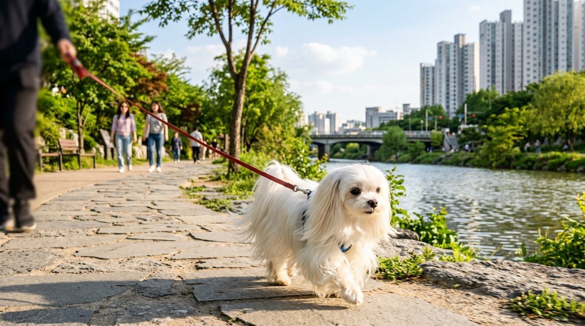
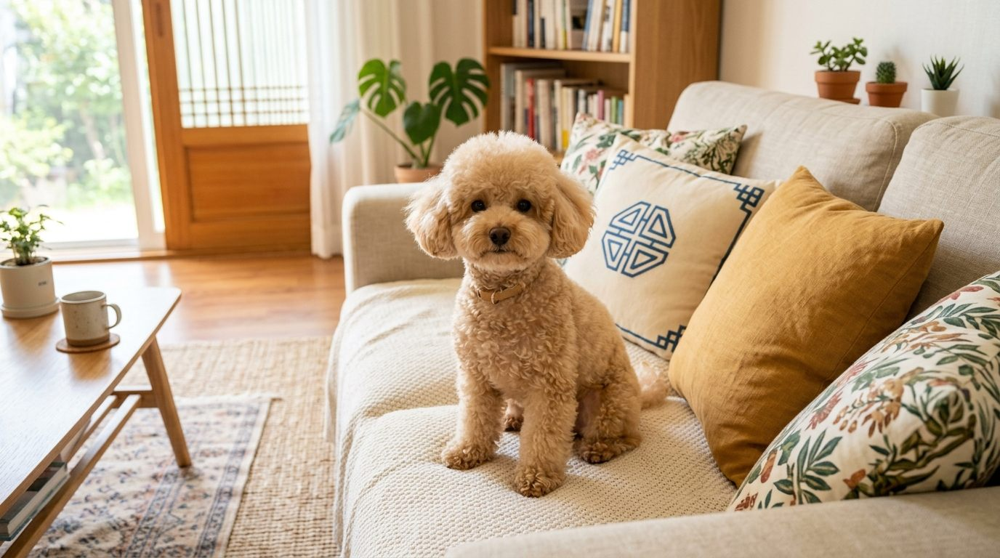
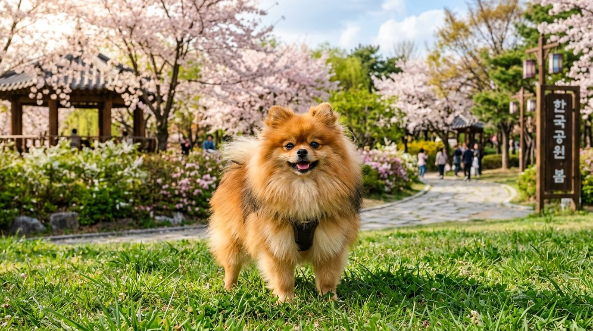
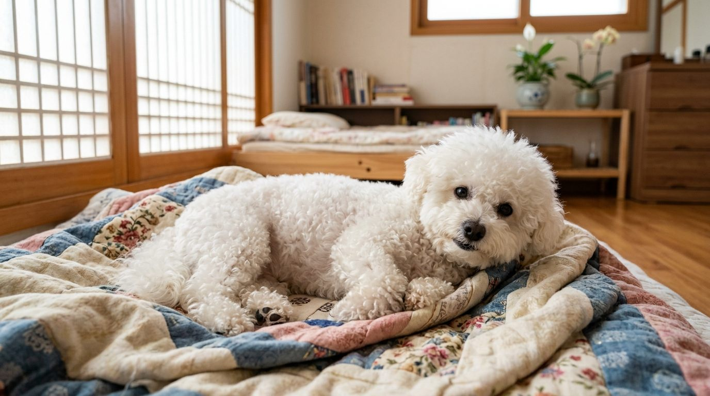
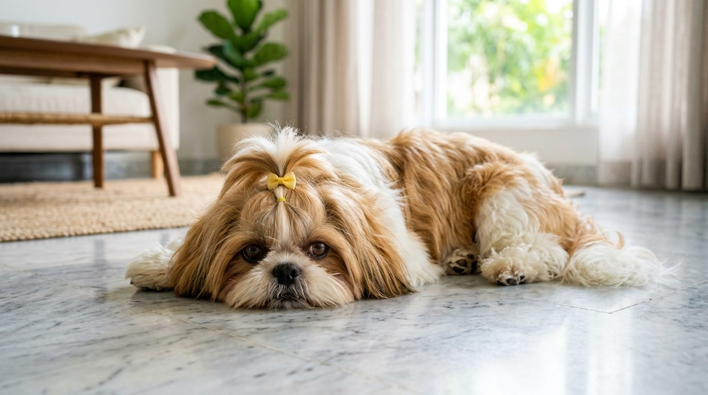
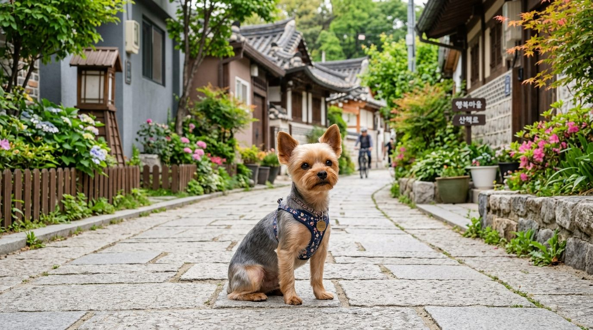
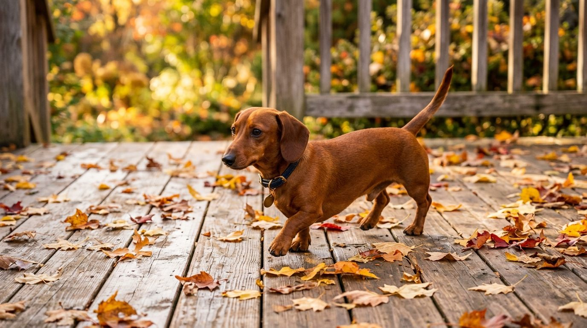

**2026년 9월 18일 기준**

## 빠른 답

**"소형견 종류, 어디부터 보면 되나요?"**

국내 기준으로 소형견은 **성견 몸무게 10kg 미만**이다(국립축산과학원). 한국에서 가장 많이 키우는 소형견은 말티즈이고, 푸들·포메라니안·비숑프리제가 뒤따른다. 견종을 고를 때는 외모보다 **짖음·그루밍·건강 관리 부담**부터 비교하는 순서로 보면 후회가 적다. 아래 표와 견종별 도감에서 그 기준을 전부 확인할 수 있다.

## 소형견 기준 — 몇 kg까지가 소형견인가

소형견을 가르는 세계 공통 공식은 없다. 국내에서 가장 많이 인용되는 기준은 국립축산과학원(농촌진흥청)의 정의다.

| 구분 | 기준 |
|---|---|
| 소형견 | 성견(생후 2년 이상) 몸무게 **10kg 미만** |

이 기준은 미국수의사회(AVMA) 정보를 기반으로 한 것이고, 견종을 공식적으로 분류한 표는 아니라는 단서가 붙는다. 재미있는 점은 같은 표에서 미니어처 슈나우저와 시바이누를 중형으로 분류한다는 것이다. 미니어처 슈나우저는 AKC 기준 체중 5.0~9.1kg으로 무게만 보면 소형이다. **기관마다, 표마다 소형·중형의 선이 조금씩 다르다**는 뜻이다. 이 글에서는 국립축산과학원 기준(성견 10kg 미만)을 따르되, 경계에 있는 견종은 따로 모아 설명한다.

## 한국에서 많이 키우는 소형견 — 등록 통계로 보면

동물보호관리시스템 등록 공공데이터를 출생연도별로 분석한 결과(2009~2021년생 등록 255만 6,004마리, 데일리벳 보도)에서 등록 수 상위 품종은 이렇다.

| 순위 | 품종 | 등록 수 | 비고 |
|---|---|---|---|
| 1 | 말티즈 | 47만 6,731마리 | 13년 누적 1위 |
| 2 | 푸들(토이·미니어처 합산) | 40만 8,765마리 | 스탠다드 푸들은 제외 |
| 3 | 믹스견 | 39만 6,564마리 | 품종이 아니어서 이 글 목록에서 제외 |

10대 품종(믹스 포함)이 전체 등록의 97%를 차지한다. 그 안에서 소형견을 짚으면 **말티즈·푸들·시츄·요크셔테리어·포메라니안·치와와·비숑프리제**가 상위권을 이룬다. 흐름도 분명하다. 2021년생, 그러니까 가장 최근 조사 대상에서는 **포메라니안과 비숑프리제가 말티즈보다 많이 등록**됐다. 반대로 시츄와 요크셔테리어는 2010년대 내내 등록이 줄었다.

이 글의 8종은 이 통계의 상위 소형견에, 국립축산과학원이 소형견으로 분류한 목록과 하운드 종류 가이드에서 심층으로 다룬 닥스훈트를 더해 골랐다.

## 소형견 8종 비교표

모든 값은 AKC 견종별 공식 표준·트레이트(5단계) 기준이다.

| 견종 | 체중 | 수명 | AKC 그룹 | 성격(AKC 표기) | 그루밍 | 짖음 |
|---|---|---|---|---|---|---|
| 말티즈 | 3.2kg 미만 | 12~15년 | 토이 | 놀기 좋아함·매력적·온순 | 4/5 | 3/5 |
| 푸들(토이) | 1.8~2.7kg | 10~18년 | 토이 | 총명·민첩·자신감 | 4/5 | 4/5 |
| 포메라니안 | 1.4~3.2kg | 12~16년 | 토이 | 호기심·활발·대담 | 3/5 | 4/5 |
| 비숑프리제 | 5.4~8.2kg | 14~15년 | 논스포팅 | 호기심·장난기·활기 | 5/5 | 3/5 |
| 치와와 | 2.7kg 이하 | 14~16년 | 토이 | 매력적·우아·새콤 | 1/5 | 5/5 |
| 시츄 | 4.1~7.3kg | 10~18년 | 토이 | 놀기 좋아함·애정·외향적 | 4/5 | — |
| 요크셔테리어 | 약 3.2kg | 11~15년 | 토이 | 애정·생기·말괄량이 | 5/5 | 4/5 |
| 닥스훈트 | 미니어처 5.0kg 이하 / 표준 7.3~14.5kg | 12~16년 | 하운드 | 호기심·친근·씩씩 | 2/5 | 5/5 |

시츄는 AKC 페이지의 공개 트레이트에 짖음 점수가 없어 비워 두었다.

## 견종별 도감

### 말티즈 — 등록 1위, 한국 대표 소형견

**AKC 표준** — 체중 3.2kg 미만 · 신장 17.8~22.9cm · 수명 12~15년 · 토이 그룹

한국 반려견 등록 1위(47만 6,731마리)다. 새하얀 장모에 털빠짐이 1/5 수준으로 적어 실내 관리 부담이 작다는 점이 인기의 밑바탕이다. 성격은 온순하고 사람을 좋아해 다세대 주거와 잘 맞는다.

관리 포인트는 털과 눈물자다. 그루밍 필요량은 4/5로 꽤 높은 편이라 매일 빗질과 정기 미용이 기본이고, 흰 털에 눈물이 묻으면 얼룩이 그대로 남으니 눈 주변을 자주 닦아줘야 한다.

건강은 슬개골 탈구, 심장 기형(동맥관 개존증), 간 션트 등 검사를 권하는 견종이다. 치아가 좁은 턱에 몰려 있어 구강 관리도 소홀히 하기 어렵다(AKC).

성격·분양가대·눈물자국 관리법을 깊게 다룬 [말티즈 품종 가이드](/breeds/maltese/)가 따로 있다.

### 푸들(토이·미니어처) — 총명함으로 고르는 소형견

**AKC 표준(토이)** — 체중 1.8~2.7kg · 신장 25.4cm 이하 · 수명 10~18년 · 토이 그룹

한국 등록 2위(40만 8,765마리, 토이·미니어처 합산)다. AKC가 표기하는 성격은 총명·민첩·자신감이며, 훈련성은 5/5 만점이다. 소형견 중에서 지능과 훈련 반응을 최우선으로 고른다면 첫손에 꼽는다.

토이는 성견이 2kg 안팎까지 내려가는 초소형이라, 강아지 시기 저혈당과 어린 아이·대형견과의 접촉은 각별히 조심해야 한다. 미니어처는 한 단계 크다.

털은 곱슬이라 빠져도 몸에 묻어나지 않는 대신, 방치하면 엉키기 때문에 정기 미용이 필수다. 건강은 특발성 간질과 슬개골 탈구가 토이·미니어처에서 스탠다드보다 흔하다고 AKC는 밝힌다.

### 포메라니안 — 최근 인기의 중심

**AKC 표준** — 체중 1.4~3.2kg · 신장 15.2~17.8cm · 수명 12~16년 · 토이 그룹

누적 등록에서는 말티즈에 밀리지만, 2021년생 등록에서는 말티즈를 추월한 최근 인기의 중심이다. 몸무게 2kg 안팎의 작은 체구에 폭신한 이중모를 두른 외모가 강점이다.

성격은 AKC 표기 그대로 '대담(bold)'하다. 몸은 작아도 겁이 없어 큰 개나 낯선 소리에도 맞서려 할 수 있어, 사회화 훈련으로 판단을 길러주는 게 좋다. 짖음도 4/5로 활발한 편이다.

건강은 기관 허탈과 슬개골 탈구가 대표적이다. 목을 조이는 목줄 대신 하네스를 쓰는 습관을 처음부터 들이자. 탈모증 X(흑피증)도 이 견종에 알려져 있다(AKC).

### 비숑프리제 — 늘어나는 흰 뭉게

**AKC 표준** — 체중 5.4~8.2kg · 신장 24.1~29.2cm · 수명 14~15년 · 논스포팅 그룹

2021년생 등록에서 포메라니안과 함께 말티즈를 넘어선 상승세 견종이다. 흰 곱슬 털에 사람을 좋아하는 성격이라 최근 수요가 꾸준히 늘고 있다.

8종 중 체구가 큰 편(최대 8.2kg)이라 작음 그 자체보다는 '다루기 쉬운 크기'를 원할 때 잘 맞는다. 수명 14~15년도 튼튼한 축이다.

대신 그루밍 필요량은 5/5 만점이다. 곱슬 털은 빠져도 잘 안 보이지만 관리를 안 하면 바로 엉키고, 눈물자와 입 주변 털 변색이 눈에 띈다. 알레르기·방광염·치아 문제가 흔하게 언급되는 견종이니 구강 관리와 정기 검진을 함께 챙기자(AKC).

### 치와와 — 가장 작은 견종

**AKC 표준** — 체중 2.7kg 이하 · 신장 12.7~20.3cm · 수명 14~16년 · 토이 그룹

AKC 공인 견종 중 가장 작은 축에 든다. 몸무게 표준이 '2.7kg 이하'로 상한만 정해져 있을 정도다. 수명 14~16년으로 긴 편이고, 단모 기준 그루밍은 1/5로 8종 중 가장 가볍다.

성격 표기는 매력적·우아·새콤(sassy)이다. 한 집안에 한 사람에게 강하게 붙는 경향이 있고, 낯선이에게는 경계심이 크다. 짖음이 5/5 만점이라 아파트라면 '조용히' 훈련과 사회화가 선택이 아니라 필수다.

건강은 심장(동맥관 개존증·승모판 질환), 슬개골 탈구, 특발성 간질이 확인되는 견종이다(AKC).

### 시츄 — 적응력으로 승부하는 실내견

**AKC 표준** — 체중 4.1~7.3kg · 신장 22.9~26.7cm · 수명 10~18년 · 토이 그룹

중국이 원산지인 견종으로, 오늘날에는 적응력 5/5를 받는 대표적 실내 애완견이다. 한국 등록에서도 꾸준히 상위권이었다가 최근에는 포메·비숑에 자리를 내주는 흐름이다.

털빠짐은 1/5로 적지만 긴 털을 유지하려면 그루밍 4/5의 노력이 든다. 손질이 부담되면 대부분 짧게 다듬는 컷으로 관리한다.

가장 주의할 것은 더위다. AKC는 무거운 털과 짧은 코 구조로 더위와 수영에 취약하다고 명시한다. 한국의 여름을 나는 시츄는 실내 온도 관리가 곧 건강 관리다. 고관절 이형성, 슬개골 탈구, 백내장 등 안과 질환 검사도 권장된다.

### 요크셔테리어 — 실크 장모의 테리어

**AKC 표준** — 체중 약 3.2kg · 신장 17.8~20.3cm · 수명 11~15년 · 토이 그룹

테리어 혈통이라 성격 표기에 '말괄량이(tomboyish)'가 붙는다. 작아도 사냥개 기질이 남아 있어 활동적이고 자기 주장이 뚜렷하다. 한국에서는 한때 인기 정점을 찍고 2010년대부터 등록이 줄었지만 여전히 상위권 소형견이다.

실크처럼 흘러내리는 장모가 상징이라 그루밍 필요량은 5/5다. 풀 코트를 유지하는 집은 드물고, 대부분 단장으로 관리한다.

건강에서 두 가지를 기억하자. 하나는 저혈당 — 3kg 내외 초소형이라 강아지 시기 혈당 관리에 특히 신경 써야 한다. 다른 하나는 슬개골 탈구인데, AKC는 예방을 위해 특히 어릴 때 점프 높이를 제한하라고 권한다.

### 닥스훈트 — 소형이지만 하운드

**AKC 표준** — 체중 미니어처 5.0kg 이하 / 표준 7.3~14.5kg · 수명 12~16년 · 하운드 그룹

독일에서 굴속 짐승을 사냥하던 후각 하운드다. 짧은 다리와 긴 몸이라는 외형은 그 사냥의 흔적이다. 계열별 이야기는 [하운드 종류 가이드](/guides/hound-types/)에서 자세히 다룬다.

한국에서는 주로 미니어처(5.0kg 이하)를 많이 보고, 표준(7.3~14.5kg)은 소형·중형의 경계에 걸친다. 짖음이 5/5라 실내에서도 목소리가 크다는 점은 미리 알아두자.

관리의 핵심은 등이다. 긴 척추에 디스크 손상이 오기 쉬워 체중 관리와 점프·계단 습관 점검이 필수라며 AKC는 강조한다. 처진 귀 구조상 귀 감염도 자주 살펴야 한다.

## 10kg 언저리에 있는 견종들

위 8종 외에 소형인지 중형인지 표마다 갈리는 견종들이 있다.

- **미니어처 슈나우저** — AKC 기준 5.0~9.1kg. 무게만 보면 소형이지만 국립축산과학원 표에서는 중형으로 분류된다. 훈련성 5/5, 짖음 5/5.
- **프렌치 불독** — AKC 기준 12.7kg 미만. 미국 AKC 인기 순위 1위 견종이지만 10kg 기준을 넘는 경우가 많다. 짖음은 1/5로 조용한 편이고, 단두종 특유의 호흡·더위 관리가 관건이다.
- **재패니즈 스피츠** — 국내 등록 10위권 안에 드는 인기견이다. 이번 8종 목록은 '등록 상위 + 소형 확정' 두 조건을 함께 만족하는 견종으로 추려 여기에는 넣지 않았다.
- **페키니즈** — 국립축산과학원이 소형견 8종으로 꼽은 목록에는 있지만, 현재 등록 순위가 낮아 도감에서는 제외했다.

## 소형견이라 미리 챙겨야 할 다섯 가지

체구가 작다는 것은 관리 항목이 달라진다는 뜻이다. 아래 다섯 가지는 소형견이라면 견종과 무관하게 미리 알아야 할 것들이다.

### 1. 치주질환 — 가장 흔하고 가장 방치되는 문제

개는 2세가 되기까지 최대 80%에서 치주질환이 시작된다(머크 수의학 매뉴얼). 소형견은 턱이 작은데 치아 수는 같아 이가 붐비는 구조라, 대형견보다 잇몸병이 더 많다. 치석은 눈에 보이는 부분이 전부가 아니고 상당량은 잇몸 아래에 숨어 있다.

관리는 매일 양치가 기본이다. 치아 관리 간식·제품을 고를 때는 VOHC(수의구강건강위원회) 인증 마크가 붙었는지 확인하자.

### 2. 슬개골 탈구 — 절뚝거리다 털고 다시 걷는 '스킵' 걸음

무릎뼈(슬개골)가 제자리 홈에서 빠지는 질환이다. 개의 7%에서 진단될 만큼 흔하고 특히 소형견에 많다(미국 수의외과대학 ACVS). 한쪽 다리를 들고 몇 걸음 절뚝이다가 털고 나서 다시 정상적으로 걷는 '스킵' 걸음이 대표 신호다. 사례의 절반은 양쪽 무릎에 온다.

1~4등급으로 나뉘고 2등급 이상이면 수술을 고려한다. 소형견의 수술 예후는 좋은 편이니, 증상을 봤다고 낙심할 일은 아니다.

### 3. 기관 허탈 — '거위가 우는 듯한' 기침

치와와·포메라니안·시츄·토이 푸들·요크셔테리어 등 전형적인 소형견에서 많다. 거위가 우는 듯한 건조한 기침이 특징이고, 밤·흥분·더위·습한 날에 악화된다(VCA).

예방의 첫 걸음은 산책 장비다. 기관을 직접 누르는 목줄 대신 하네스를 쓰자. 진행성 질환이라 초기 관리가 중요하다.

### 4. 저혈당 — 토이급 강아지의 응급

몸이 작은 토이급 새끼는 지방과 근육이 적어 글리코겐을 충분히 저장하지 못한다. 식사 사이에, 특히 활동·추위·스트레스 뒤에 혈당이 뚝 떨어질 수 있다(AKC).

갑자기 극도로 나른해지거나 비틀거리면 저혈당을 의심하자. 의식이 있다면 꿀이나 시럽을 잇몸에 발라주고 곧바로 병원으로 가야 한다. 12주 미만·입양 직후 시기가 위험 구간이다.

### 5. 비만 — 1kg이 수명을 바꾼다

소형견은 하루 필요 열량 자체가 작아서, 간식 몇 개가 전체 칼로리에서 큰 비중을 차지한다. 과체중·비만 개는 59%에 이른다(VCA). 과체중 요크셔테리어의 평균 수명은 13.7년, 정상 체중은 16.2년이다(AKC 인용 연구).

기준은 간단하다. 간식은 하루 총 칼로리의 10% 이내. 소형견에서 '조금'이라는 말은 대형견보다 훨씬 무겁게 들어맞는다.

그리고 하나 더. 소형견은 대형견보다 오래 산다. 16만 9천 마리 분석에서 평균 수명은 소형 14.95년, 중형 13.86년, 대형 13.38년이다(AKC). 같은 연구에서 매년 치아 스케일링을 받은 개는 사망 위험이 약 20% 낮았다 — 첫 번째 항목의 치아 관리가 그대로 수명으로 이어지는 셈이다.

## FAQ

**소형견은 아파트에서 키우기 쉽나요?**

체중과 운동량 면에서는 분명히 유리합니다. 다만 짖음은 몸무게와 상관이 없습니다. 치와와·닥스훈트·미니어처 슈나우저는 AKC 짖음 지표가 5/5 만점이니, 층간소음을 생각한다면 '조용히' 훈련과 사회화를 먼저 계획하세요.

**소형견 강아지가 갑자기 축 처지면 어떻게 하나요?**

저혈당일 가능성을 먼저 생각하세요. 의식이 있다면 꿀이나 시럽을 잇몸에 바르고 즉시 병원으로 가야 합니다. 비틀거림·떨림·무기력이 신호고, 12주 미만 토이급에서 특히 잦습니다. 사고로 넘기지 말고 병원 진료가 원칙입니다.

**소형견 산책도 매일 해야 하나요?**

필요한 총량은 대형견보다 적지만, 산책의 목적은 운동만이 아닙니다. 냄새 맡기·사회화·자극은 몸무게와 무관하게 필요합니다. 나이별 시간 기준과 첫 산책 시기는 [강아지 산책 가이드](/guides/dog-walking/)에 정리해 두었습니다.

**소형견 사료는 뭘 기준으로 고르나요?**

알갱이 크기와 급여량이 다를 뿐, 영양 기준은 같은 잣대로 보면 됩니다. AAFCO 영양적합성 표기와 라이프스테이지 표시를 먼저 확인하세요. [강아지 사료 고르기 가이드](/guides/choosing-dog-food/)에 봉투 뒷면 확인 순서를 정리해 두었습니다.

**소형견은 정말 오래 사나요?**

평균적으로는 그렇습니다. 소형 14.95년, 중형 13.86년, 대형 13.38년으로 견종 크기가 커질수록 수명이 짧아지는 경향이 관찰됩니다. 다만 견종별 편차가 커서 같은 소형이라도 10~18년까지 벌어지니, 견종별 수명은 위 도감 표를 확인하세요.

## 출처

- [국립축산과학원 반려견 소개](https://www.nias.go.kr/companion/new_petBoard.do?cmCode=M170718155128718) (소형견 = 성견 10kg 미만 기준, 국내 친숙 소형견 분류)
- [가장 많이 등록된 반려견은 말티즈 — 데일리벳](https://www.dailyvet.co.kr/news/industry/176732) (동물등록 공공데이터 출생연도별 분석, 등록 수·추세)
- [AKC 말티즈](https://www.akc.org/dog-breeds/maltese/) · [AKC 토이 푸들](https://www.akc.org/dog-breeds/poodle-toy/) · [AKC 포메라니안](https://www.akc.org/dog-breeds/pomeranian/) · [AKC 비숑프리제](https://www.akc.org/dog-breeds/bichon-frise/) · [AKC 치와와](https://www.akc.org/dog-breeds/chihuahua/) · [AKC 시츄](https://www.akc.org/dog-breeds/shih-tzu/) · [AKC 요크셔테리어](https://www.akc.org/dog-breeds/yorkshire-terrier/) · [AKC 닥스훈트](https://www.akc.org/dog-breeds/dachshund/) · [AKC 미니어처 슈나우저](https://www.akc.org/dog-breeds/miniature-schnauzer/) · [AKC 프렌치 불독](https://www.akc.org/dog-breeds/french-bulldog/) (견종별 체중·수명·성격·그루밍·건강 표준)
- [Periodontal Disease in Small Animals — Merck 수의학 매뉴얼](https://www.merckvetmanual.com/digestive-system/dentistry-in-small-animals/periodontal-disease-in-small-animals) (2세까지 최대 80% 유병률)
- [Periodontal Disease in Dogs — PetMD](https://www.petmd.com/dog/conditions/mouth/periodontal-disease-dogs) (잇몸 아래 치석, 소형견 위험 요인)
- [VOHC 수의구강건강위원회](https://vohc.org/) (치아 관리 제품 인증 마크)
- [Patellar Luxations — ACVS](https://www.acvs.org/small-animal/patellar-luxations/) (진단률 7%, 등급·스킵 걸음·양쪽 침범 절반)
- [Luxating Patella in Dogs — VCA Animal Hospitals](https://vcahospitals.com/know-your-pet/luxating-patella-in-dogs) (호발 견종·등급)
- [Tracheal Collapse in Dogs — VCA Animal Hospitals](https://vcahospitals.com/know-your-pet/tracheal-collapse-in-dogs) (거위 우는 기침, 하네스 권고)
- [Hypoglycemia in Dogs — AKC](https://www.akc.org/expert-advice/health/hypoglycemia-in-dogs/) (토이급 저혈당 기전·응급 처치)
- [Obesity in Dogs — VCA Animal Hospitals](https://vcahospitals.com/know-your-pet/obesity-in-dogs) (과체중 59%, 간식 10% 이내)
- [Why Do Small Dogs Live Longer? — AKC](https://www.akc.org/expert-advice/health/why-do-small-dogs-live-longer/) (16만 9천 마리 수명 분석, 치아 스케일링과 사망 위험)

> 이 글의 표지·견종별 이미지는 AI로 생성한 실사 스타일 이미지입니다.
